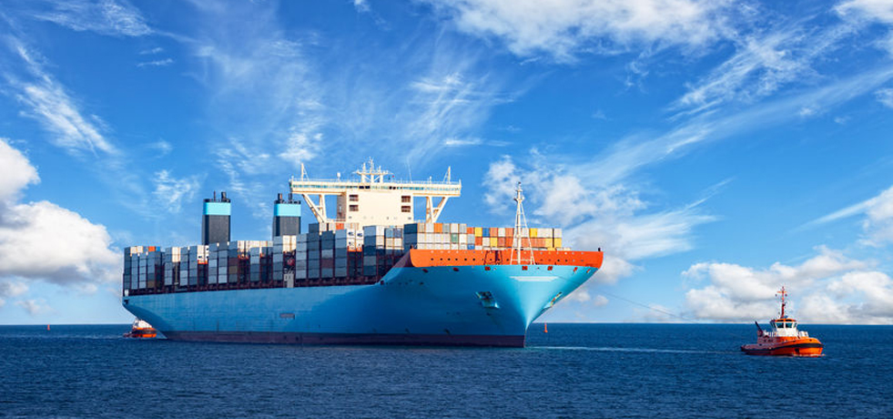

---
# This is the frontmatter which goes at the top of the MDX file
# Hashes in the frontmatter are comments
title: Blockchain for Supplychain 
author: Srikanth Jallapuram
date: 2019-02-05
featuredImage: ./bc02.jpg
---

import styles from '../../styles/another.module.css'

#### What is blockchain? 
A blockchain is a distributed, digital ledger. The ledger records transactions in a series of blocks. It exists in multiple copies spread over multiple computers, typically known as nodes.

Now, let's compare with supply chain. The key blockchain features of Bitcoin align with the basic needs for reliability and integrity in a supply chain. 

 The ledger is secure because each new block of transactions links back to previous blocks in a way that makes tampering practically impossible. 

Because it is decentralized, the blockchain ledger does not depend on any single entity (like a bank) for safekeeping. The nodes connected to the blockchain network get updated versions of the ledger every time a new transaction takes place.

The multiple copies of the ledger are the “truth” about every transaction made so far in the blockchain. Any attempt at falsification would mean having to tamper with all the copies at precisely the same moment. The chances of being able to do this in blockchain networks of any useful size are negligible.

### **Consensus**

All the entities in the chain agree that each transaction is valid. For Bitcoin, that means a transfer of an amount of Bitcoin. For supply chain, it could be payment, warehousing, [transport or delivery](https://www.logisticsbureau.com/transport-consultants-fleet-management-design-ad/).

### **Provenance**

The entities in the chain know where each asset originated. They also know who owned it before and at what time. For Bitcoin, the asset is money. For supply chain, assets can be anything from iron ore and wheat to cash, machines, and copyrights.

### **Immutability**

No entity can tamper with an entry in the distributed ledger. It is not possible to erase a Bitcoin transaction. Only a new Bitcoin transaction can reverse the effect of a previous one. Similarly, with blockchain, it would not be possible to falsify a supply-chain payment transaction or the records of inventory, warehousing conditions, delivery times and dates, and so on.

### **Finality**

The copies of the shared ledger all hold the same version of the truth. What works for the Bitcoin network also works for any other blockchain network, supply chain included.

> Second, the applications for blockchain in supply chain are far more diverse than making or receiving payments. A large part of this diversity comes from the use of smart contracts.

A smart contract is a software program that uses blockchain to execute an agreement. The program is stored on the blockchain so the smart contract can only function according to its programming.  No fraud or other interference is possible.

A smart contract can take input from a ledger and trigger an event. For example, after receipt of a payment as part of a transaction, the smart contract can trigger a delivery. Conversely, if a requirement (such as timely delivery or proper storage) is not met as expected the smart contract can trigger a penalty or similar sanction.

Third-party go-betweens are not necessary for the execution of smart contracts. Manual checking of conditions and events are obsolete endeavors. A software program that runs automatically, using information that is guaranteed by the blockchain to be correct, saves both time and money.

## **Applications of Blockchain in Supply Chain**

The following examples are now in use or can be implemented today using existing technology.

 

### **Automotive Supplier Payments**

Blockchain allows the transfer of funds anywhere in the world without the need for traditional banking transactions, as transactions are made directly between payer and payee. It is also secure and rapid; taking minutes, compared to days for automated clearing house payments, for example.

Bitcoin transfers specifically also incur lower fees. Australian vehicle manufacturer Tomcar uses Bitcoin to pay some of its suppliers. Currently, three partners in Israel and Taiwan accept payment from Tomcar using Bitcoin.

Tomcar’s supplier agreements use standard terms. The advantage is in the cost savings. On the other hand, the firm is careful to avoid hanging onto too much Bitcoin. While Bitcoin is international by nature, some national governments see it as a way for companies to invest. Companies may therefore be subject to taxation on Bitcoin holdings.

### **Meat Traceability**

Companies can use distributed ledger systems (blockchains) to record product status at each stage of production. The records are permanent and immutable. They make it possible to trace each product to its source. Global retailer Walmart uses blockchain to track sales of pork in China. Its system lets the company see where each piece of meat comes from, each processing and storage step in the supply chain, and the products’ sell-by date. In the event of a product recall, the company can also see which batches are affected and who bought them. 

### **Electric Power Micro-grids**

This example shows how entities of any size can use blockchain. In other words, blockchain is not just for the big players. Smart contracts are being used to redistribute excess power from solar panels. The Transactive Grid is an application running on blockchain to monitor and redistribute energy in a neighbourhood micro-grid. The program automates the buying and selling of green energy to save costs and pollution. The process uses the Ethereum blockchain platform, designed specifically for building and executing smart contracts.

### **RFID-driven Contract Bids and Execution**

RFID tags are commonly used in supply chain to store information about products. IT systems can read the tags automatically and then process them. Therefore, the logic goes; why not use them for smart contracts in logistics?

The possible setup could be as follows. RFID tags for cartons or pallets store information on delivery location and date. Logistics partners run applications to look for these tags and bid for a delivery contract. The partner offering optimal price and service gets the business. A smart contract then tracks status and final delivery performance.

### **Cold Chain Monitoring**

Food and pharmaceutical products often have specialized storage needs. Moreover, enterprises see the value in sharing warehouses and distribution centers instead of each one paying for its own. Sensors on sensitive products can record temperature, humidity, vibration, and other environmental conditions.

These readings can then be stored on a blockchain. They are permanent and tamper-proof. If a storage condition deviates from what is agreed, each member of the blockchain will see it. A smart contract can trigger a response to correct the situation. For instance, depending on the size of the deviation, the action may be to adjust the storage. However, it could also extend to changing “use-by” dates, declaring products unfit, or applying penalties.

### **Blockchain and Internet of Things**

Other ambitious ideas come from using blockchain and the IoT. One suggestion is for smart contracts to manage rentals of driver-less cars. A smart contract could check for rental payments. If there has been no payment or the rental agreement reaches the end of its term, the smart contract could lock the car and tell it to drive itself back to the hire company's premises.

## **Real World Supply Chain Blockchains in 2019**

 

It’s always exciting to see how emerging technologies like blockchain progress and develop. Nearly a year after first publishing this article, we are seeing the supply chain and logistics domain evolving into one of the most active sectors for blockchain take-up.

For that reason, it seemed a good idea to document a few examples of how our industry is embracing distributed ledger technology and applying it to solve long-standing business problems. Let’s start with ocean freight shipping, which is an area in which blockchain innovation has been prolific over the last 12 months.

 

### **Tokenizing the Shipping Industry with Ethereum**

 

Hong Kong-based company 300Cubits set out in 2018 to solve an expensive and lingering problem in the container shipping industry—the preponderance of no-shows, when shippers fail to deliver cargo booked on a container vessel, and rolling, which is the outcome of shipping lines’ choice to safeguard vessel utilisation by overbooking to compensate for expected no-shows.

The 300Cubits response to the problem was to issue a TEU cryptocurrency and distribute a quantity of the tokens to shippers and shipping lines in 2018. Participants in the scheme use 300Cubits’ blockchain solution, based on Ethereum, to make deposits using the tokens when cementing a shipping transaction (the contract).

### **How Does the System Work?**

The way it works is that the shipper and the shipping line both deposit a token in the blockchain when the shipper books cargo onto a sailing. To recover their escrowed tokens, both the shipper and the shipping line must honor the booking.

If the shipper does not present the cargo in time for loading on the vessel, the shipping line can recover its token—along with the shipper's token—from escrow. Similarly, if the shipping line fails to transport the shipper's cargo as agreed, the shipper receives both deposited tokens.

While 300Cubits issued the initial batch of tokens, free of charge, to participating shippers and shipping lines, it will sell subsequent batches for payment in fiat currency, ensuring that the tokens acquire monetary value. This value ensures financial consequences for shippers or shipping lines that renege on a booking. A smart contract, executed using the 300Cubit's solution, automatically assigns tokens when a booking is made and reassigns them based on the outcome.

### **How Does Blockchain Solve the Problem?**

The 300Cubits venture essentially makes it less likely that shippers will fail to deliver their cargoes to ports as promised, since it will cost them money to do so. At the same time, the shipping lines will lose out if every time they roll a customer's shipment.

If successful, the scheme should reduce overbooking activity by shipping lines, ensuring that shippers do not suffer delays in the transportation of their cargoes. It should also help shipping lines utilise vessel capacity more effectively.

