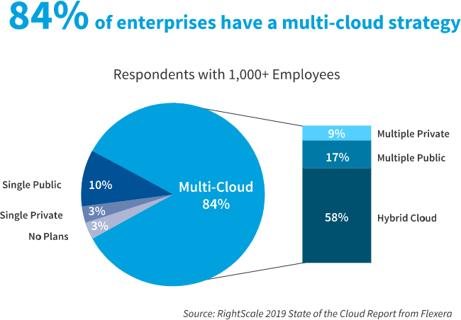
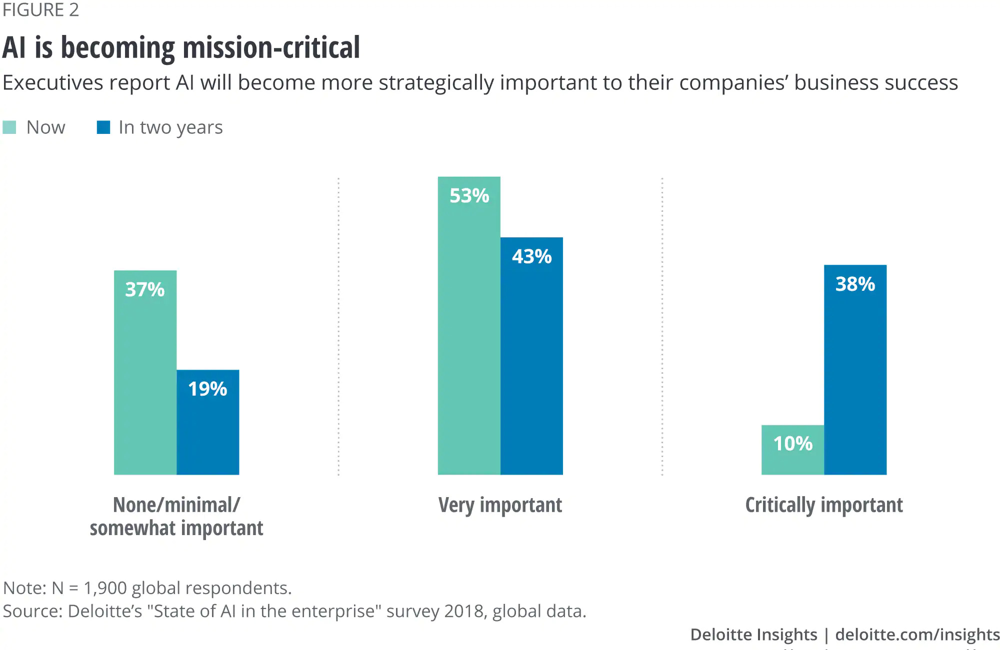

---
# This is the frontmatter which goes at the top of the MDX file
# Hashes in the frontmatter are comments
title: Cloud Strategies 
author: Srikanth Jallapuram
date: 2019-02-05
featuredImage: ./cloudcomp.jpg
---

import styles from '../../styles/simpleblock.module.css'
import styles1 from '../../styles/another.module.css'

<blockquote className={styles.blockquote}>
One of the things we've learned is that if you can't get it to market more quickly, there is no doubt that the market will have changed and no matter how well you've engineered it or built it or deployed it or trained your folks, it's not going to be quite right because it's just a little too late.

James McGlennon <cite title="Source Title"> Executive VP and CIO, Liberty Mutual Insurance Group
 </cite>

  </blockquote>

# Enterprise Cloud Strategies for 2019-20

The adoption and evolution of Cloud technologies by (the) enterprises over the past decade has made the technology very matured and  highly potent that it compels every Enterprise IT practitioner to explore that potential and draaw some key strategies for Cloud adoption to harness the power of the Cloud in the enterprise. The key is to leverage extensive business agility, make enterprise wide Innovation really possible and a ubiquitous global access and availability to an entire suite of their enterprise IT & applications without restrictions while not compromising on the Application and IT security at the same time.

As multicloud strategies evolve, 5G, Containers and Serverless Computing influence the expectations by the Enterprise IT Practitioners and CIO/CXOs. They are

- Greatly reduced operational burden 
- Tighter alignment to costs w/usage
- Developers can/could/should be able to develop almost anything (Speed of Innovation)
- Opinionated platforms that allow for multiple use-cases
- Opinionated platforms that bake in true best of breed practices, security, scale, performance, cost aspects for you

## 1. A greater emphasis on TCO and ROI

What workloads to migrate to the cloud is very important to consider. CIOs should often ask the question as to how they can go about moving to cloud and how they can modernize apps once they are there. CIOs also ask whether moving to the cloud will cost more or less than operating on-premises environments. “There is a lot of FUD out there that that movement won't reduce costs,” Carter says. The answer depends on how CIOs architect their systems, she says, but there are also tools that can help CIOs make critical decisions.

Earlier this year, [AWS acquired TSO Logic](https://www.geekwire.com/2019/amazon-web-services-acquires-tso-logic-vancouver-startup-working-cloud-spending-analysis/) to help enterprises understand how much it will cost to shift their systems to the cloud. “What it enables you to do is look at what you have on-prem and understand that if you just took that and went straight to the cloud, you're going to spend more money,” Carter says. “Why? Because you're usually over-provisioned.”

Companies are also increasingly adopting FinOps, a combination of [business management practices and analytics software](https://www.cio.com/article/3379619/finops-best-practices-for-cloud-cost-optimization.html) that calculates the consumption of cloud once they migrate there.

## 2. Multi-cloud strategies on the rise

Enterprises are running computing workloads in production on at least two of the big three public cloud carriers. Tyson Foods is migrating applications to AWS and GCP, each of which offer unique value propositions.  While AWS has a breadth of services, GCP provides full instrumentation of its whole cloud stack per each computing node, as well as orchestration of containers for Kubernetes with some built-in AI services.

Some of the Enterprises such as State Farm is embracing both the “lift and shift” approach, which entails moving apps from on-premises systems to the cloud, and “cloud-native” development, which includes building and deploying software in the cloud, as it works with AWS, Azure and GCP, says Ashley Pettit, State Farm senior vice president of IT.

Embracing all three vendors will allow State Farm greater flexibility in developing software, says Petit, who is moving the company from mainframe and other legacy systems. State Farm is moving its Drive Safe & Save mobile application, as well as apps for pricing and underwriting models, to AWS.

## 3. Serverless

Serverless has already established itself as the core backbone and the cornerstone of a Multi-Cloud and a Cloud-Native architecture (or strategy)

**Knative** is a Kubernetes-based platform to deploy and manage modern serverless workloads.

Knative components build on top of Kubernetes, abstracting away the complex details and enabling developers to focus on what matters. Built by codifying the best practices shared by successful real-world implementations, Knative solves the "boring but difficult" parts of deploying and managing cloud native services so you don't have to.

- Pluggable components let you bring your own logging and monitoring, networking, and service mesh.
- Knative is portable: run it anywhere Kubernetes runs, never worry about vendor lock-in.
- Idiomatic developer experience, supporting common patterns such as GitOps, DockerOps, ManualOps.

*Figure 8.1: Kubernetes Frameworks *

## 4. Innovation in the cloud

Thanks to containers, Kubernetes, and “serverless” computing, the way core enterprise applications are deployed is being reshaped. Adoption of Docker containers has grown in recent years as corporate developers have modernized application deployment.

Kubernetes, the software that automates the deployment, scaling and management of containers, has emerged as the enterprise's orchestration layer of choice. And it has become way easier to deploy, scale and secure, with vendors rolling out new features for API-driven security policy orchestration.

Serverless, in which [customers operate applications without building and maintaining the infrastructure to run them](https://www.cio.com/article/3244644/serverless-the-future-of-cloud-computing.html?nsdr=true), is already gaining traction as more companies look to roll out digital services and applications. It provides an API to associate the function with one or more event, such as when an IoT sensor facilitates an action, a file uploaded by a CRM App , too many help desk requests risen beyond a set threshold and many such scenarios.

Enterprise CIOs are trying to get out of spending time and money on maintaining systems. Moving to a serverless cloud architecture enables them to focus on what matters to their business most and increases their agility to serve their business needs for a wider collaboration and core Innovation while allowing them to develop and roll out new capabilities quickly.

In a recent Gartner survey of technical professionals based
primarily in North America, 40% of respondents indicated that
their organizations would be spending the majority of new or
additional funding on the cloud. However, the survey also found
that the cloud is the most common area for talent gaps.
  

Serverless, along with containers and Kubernetes, forms the foundation for modernizing core business apps. In the very near future, we can envision that all of cloud will be serverless.  We can say that the tech industry is only at the “tip of the spear” regarding serverless. Hence nurturing core talent for adopting and maintaining a cloud-first environment or architecture becomes an imperative.

Gartner estimates that more than 20 percent of global enterprises will deploy serverless computing technologies by 2020, an increase from fewer than 5 percent today.

## **5. 80% of processes move to Cloud**

As said above, until recently the skepticism about migration of Information Systems to Cloud was very strong. The reasons for it were a lack of confidence about the security of data and processes and the traditional resistance to change. Nowadays, data show that in the following years 80% of business processes will move to the Cloud, but not only that. Studies say that there is another trend connected to the Cloud migration. Indeed, many companies refactoring their on-premise infrastructures to move them easily to Cloud-native environments.

## 6. AI is replacing Automation in the Cloud

 It is predicted that in 2019, companies will accelerate their usage of cloud-based artificial intelligence (AI) software and services. Among companies that adopt AI technology, 70 percent will obtain AI capabilities through cloud-based enterprise software, and 65 percent will create AI applications using cloud-based development services. (source: Deloitte Global)

By 2020, penetration rates of enterprise software with integrated AI and cloud-based AI platforms will reach an estimated 87 percent and 83 percent, respectively, among companies that use AI software. Cloud will drive more full-scale AI implementations, better return on investment (ROI) from AI, and higher AI spending. Importantly, we will see the democratization of AI capabilities—and benefits—that had heretofore been the preserve only of early adopters.

Across all countries, AI early adopters are seeing positive financial returns, reporting an average ROI of 16 percent. This is a promising start for companies that are gaining experience with a rapidly evolving set of technologies with AI and also provides them a much required competitive edge in the marketplace.

Encouraged by their successes, and betting that AI will play a critical role in enhancing their competitiveness, companies are increasing their AI investments.

## **7. SaaS ecosystems will rise**

Integration plays are ramping up, evidenced by Salesforce.com’s purchases of API management vendor MuleSoft and data visualization player Tableau. Expect integrated SaaS-based industry ecosystems to spawn, driven by enterprise software stalwarts such as Microsoft, Oracle and SAP, Bartoletti says. Early examples will come from supply-chain-intensive industries with a strong need to share information and collaborate across organizations, such as industrial, healthcare, manufacturing and government, Bartoletti says.

## Next Steps
Technovature recommends the below next steps to kickstart a cloud-first thinking in your organization
- Start developing and implementing a cloud-first strategy now, with an emphasis on multicloud architecture. Enterprises must advance the use of public cloud services to become the primary, prioritized and promoted deployment model. 

- Embrace public cloud while continuing to evolve your data center resources to be more efficient and more hbrid. Define integration strategies between data centers and public clouds.

- Strategically rethink and invest in your network architecture for multicloud. Implement robust
network architecture that can enable hybrid IT and multicloud cost-effectively and redundantly.

- Act now to establish your organization’s cloud-first blueprint or architecture. Find the best partners who can provide with a combination of high-quality consultancy, who can also supplement with experienced enterprise architects, I&O architects or application architects specialized in the cloud-first architecture. 
