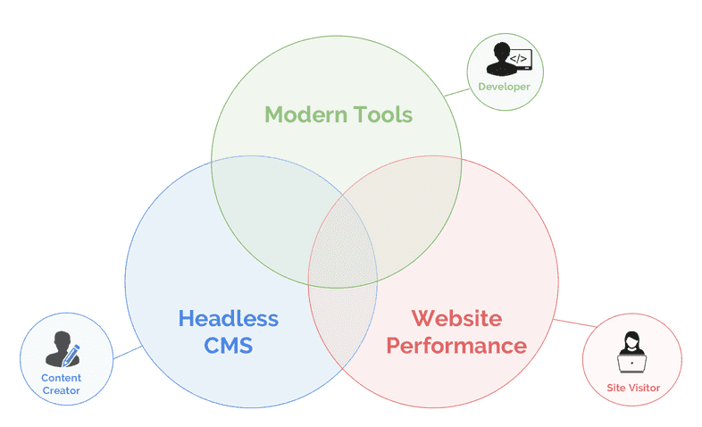
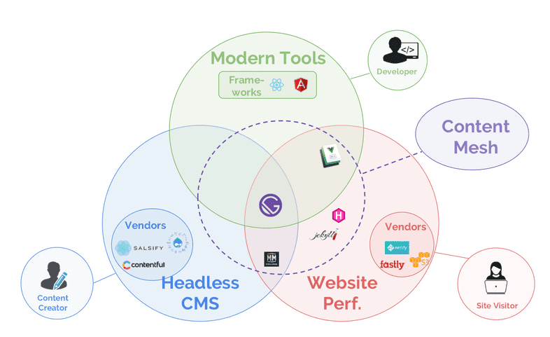
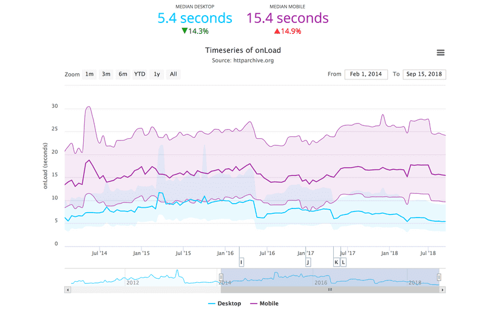

import styles from '../../styles/another.module.css'

 
 

At the BBC, 10&#37; of users are lost for every additional second the site takes to load.

# So What is GatsbyJS?
GatsbyJS is a modern website framework with built-in performance to allow businesses to easily create ultra-fast sites.It provides Server Side Rendering, High Security and Fast Loading out of the box. Your ability to connect to a myriad of data sources including Headless CMS via JSON/REST API is also a huge plus as the complexity of creating, preparing and managing of the data can be kept external to your static website. 

### Web Development Challenges

Building a website is **hard** and we always **underestimate** the effort needed, specially when it counts to best practices and accessibility. Image management and Image optimization especially for responsive design for various device types and device sizes, it is another nightmare. There a lot of checkboxes you need to check before shipping your website and failing to do it is not and option. The onus is on web developers that they need to provide the best possible user experience for everyone everywhere else we may be not reaching everyone that needs that app/site or information at that moment. It is our primary duty as web developers to always do our best to reach as much people as possible, regardless of their devices, their network speed or anything else.

#### So how does GatsbyJS help?

Gatsby provides **a lot** of best practices and solid solutions right out-of-the-box. It is a core value of the Gatsby team that websites should be performant by default. Progressive image loading, Inlining of critical CSS? Painless PWA configuration? Easy Access to Data sources via API, you name it, Gatsby has got you covered for it. 

#### Progressive Image Loading

Modern websites rely on a lot of story telling that includes rich media, high quality images, iconry and modern typography that are heavy weight assets that try to reach the mobile canvas or your desktop browser vying for the piece of that real-estate to wow the users with a rich and engaging user experience.

However, faster and high speed data networks does not translate to superior user experience as the loading times of the first page or the first content paint matters a lot as users turn away if they do not get instant loading of web pages and grab their attention (shorter attention spans in a fast moving world?) thus leading to high bounce rates. 

Gatsby provides an amazing solution for images that is so good, that is constantly referred as a strong point of Gatsby, even thought it actually is a plug-in. Just by adding a couple of plug-ins into your Gatsby config file and you're good to go. Your images will be available on the GraphQL API at build time and the image component will handle all the resizing, picking the best file format, lazy loading of the images, applying filters (if you choose to) and everything else. You even get a blur up effect to improve the user experience for free. Thus drawing down a superior user experience for the users with faster loading of pages and decreasing the bounce rates.

#### And?

GatsbyJS provides an amazing developer experience that eventually adds to an amazing productivity of the developer or a development team. 

- You have **HMR (Hot Module Reloading)**, which let you have that instant feedback without the need to reload the page and lose the state.
- Your application will be static, so you can go **serverless**, which makes the whole ops to have your app always available and ready to go simply not your problem. Zero worries about maintaining a server. This is a dream come true for many first-time developers or even for seasoned developers as the server management or cpanel management comes with many hassles and usually takes away too much of time.
- Whatever may be the collection of assets , you have the most efficient and simplest **asset pipeline** where everything is done at build time.
- You can also have previews of your PRs deployed making super easy to visualize the changes.

### Performance?

Gatsby sites are **2-3 times faster** than similar types of sites. The framework takes care of performance on its own, leaving you with the pleasure of working on something more fun. 

All you have to do is to create the source code, and GatsbyJS will then compile the most performant **Webpack configuration** to build your site. Additionally, it prefetches resources so clicking through your pages feels excitingly fast. 

Gatsby follows Google's [PRPL](https://developers.google.com/web/fundamentals/performance/prpl-pattern/) architectural pattern which aims to boost your website's performance, especially on mobile devices.

**PRPL** stands for:

- Push
- Render
- Pre-cache
- Lazy-load

The pattern is for structuring and serving **progressive web apps** (PWAs), and yes, you can create PWAs with GatsbyJS with a very simple configuration including the option for adding service workers. 

All you have to do: Make sure to run your page via HTTPS and install a plug-in for the manifest and service worker. Gatsby already meets all other [requirements](https://www.gatsbyjs.org/docs/progressive-web-app/) for PWAs out of the box.

## Based on popular and influential technology

Gatsby is based on React.js which is a JavaScript library for building User Interfaces (UI) using ReactJS  components. It's relatively easy to learn, and if you're able to write solid JavaScript code, you're good to go. Gatsby aims to behave like a **regular React application** and uses its components which you can **reuse** and share throughout your project. So all the ReactJS components you may have created in the course of time? You can plug them in quite seamlessly into the Gatsby project and start using them instantly.

### Did we say GraphQL?

If you haven't already got your hands on the GraphQL technology, this is your chance to finally start working with [GraphQL](https://graphql.org/). GraphQL is a query language with which you can fetch data from nearly any source. One of its most powerful features is its ability to get only the data you ask for— **you decide** what you want and need, not the server/source. Therefore, Gatsby doesn't need a classic backend and GraphQL lets you query all necessary data from wherever you want: markdown files, local file systems, local images, JSON files, JSON API, REST API, databases, [Storyblok](https://www.storyblok.com/tp/gatsby-multilanguage-website-tutorial), Headless and traditional CMSs like contentful, GhostCMS, Drupal and so on.

### What about SEO?

Gatsby can help your site rank and perform better in search engines. Using Gatsby makes your site fast and efficient for search engine crawlers, like Googlebot, to crawl your site and index your pages. Some advantages, like speed, come out of the box and others require configuration.

##### Server rendering

Because Gatsby pages are server-side rendered, all the page content is available to Googlebot and other search engine crawlers. Server rendered content is the most preferred way of crawling done by Search Engines such as Google which means it adds up to the better ranking for your site or content. 

##### Speed boost

Gatsby’s many built-in performance optimizations, such as rendering to static files, progressive image loading, and the [PRPL pattern](https://www.gatsbyjs.org/docs/prpl-pattern/)—all help your site be lightning-fast by default.

##### Page meta-data

Adding meta-data to pages, such as page title, meta description, alt text and structured data using JSON-LD, helps search engines understand your content and when to show your pages in search results.

A common way to add meta-data to pages is to add [react-helmet](https://github.com/nfl/react-helmet) components (together with the [Gatsby React Helmet plugin](https://www.gatsbyjs.org/packages/gatsby-plugin-react-helmet) for SSR support) to your page components.

##### Generate rich snippets in search engines using structured data

Google uses structured data that it finds on the web to understand the content of the page, as well as to gather information about the web and the world in general.

Now that we have the basics and the internals covered for GatsbyJS, it is important to understand the philosophy and the direction of the modern web development. Where is the modern web development headed to? How can we achieve minimalism, high functionality with great performance and speed while delivering superior user experience and engagement with superb interactivity? How does the approach towards modern web development help us achieve those goals?

We need to understand how GatsbyJS could help us beyond the initial scaffolding of a highly performant static websites to achieve the holy grail of web development that not only delivers world-class user experience but also ensures the developers are super happy with their toolkit.

## The Case for a Multi-Service Multi-Source CMS Static Site:

Today, a website team running an e-commerce site can store product inventory in Shopify, product listings in Salsify and reviews in Bazaarvoice. A team running a paywalled content site can create stories in WordPress, store video in JWPlayer, user data in Auth0, and subscription data in Recurly.

When website teams want to add search, they can turn to Algolia; for payments, Stripe; for analytics, Segment; for A/B testing, Optimizely; for personalization, Evergage.

Teams are adopting these services because each is tailored to a specific use-case; the generic enterprise CMS alternative is often optimized for none.

## Emergence of the Content Mesh
We are at an important crossroads of modern web development where proliferation of powerful B2B and B2C techologies with a SaaS delivery form has emerged over the last decade to the delight of the Developer or Enterprise Customer. However with this abundance and diversity came a nightmare to integrate these into a single Web Platform or a Website Experience. It created the right conditions to explore the emergence of a “content mesh” — the infrastructure layer for a decoupled website. The content mesh stitches together content systems in a modern development environment while optimizing website delivery for performance.

The content mesh empowers developers while preserving content creators’ workflows. It gives you access to best-of-breed services without the pain of manual integration.

## Three Areas of Rapid Innovation
Change is being spurred by the confluence of three revolutions in how we create and consume content:

- **Content management** - Monolithic CMS applications are being replaced by modular, specialized content systems.

- **Development techniques** - Modern UI frameworks like React are becoming essential to rich user experiences.

- **Performance** - As mobile surpasses 50% of internet traffic, high-performance is becoming a must-have, not a nice-to-have.

<figure>

<figcaption style={{marginLeft:'100px', textAlign:'center'}}> Fig 1.1 : Moderen Websites </figcaption>
</figure>

These technological changes have made modern web technology both essential for creating fresh, novel, and engaging digital experiences, and more accessible for the enterprise.

Each change primarily affects a different stakeholder --- marketing, development/IT, and the end user, respectively.

The key challenge is that without a content mesh, integrating these systems together is a lot of work. Forrester titled one of their report sections: “Warning: Headless Content Management Is For Do-It-Yourself Shops.” But with a content mesh, all of these systems can be brought together in a unified, low-cost, low-defect whole.

In other words, the content mesh makes developers, content creators, and users all happy.

### The Modern Website Landscape 

 

### How can Content Mesh Help?

Today, enterprise CPG, clothing, and consumer durables companies face dual threats from Amazon and hip DNVBs like Dollar Shave Club and Bonobos. Enterprise travel companies face off with Kayak and Expedia. News organizations have taken heavy losses from upstart content sites and Facebook/Google. And so on.

But creating compelling experiences is challenging:

Marketers need content systems that model the website domain well to craft compelling messages.

Development teams need UI frameworks that allow easy design customization to keep the site look and feel fresh.

Business owners need high-quality add-ons like search, analytics, forms and payment to demonstrate value and justify continued investment. In addition, they need their sites to be fast.

One popular, paywalled, news site that currently stores all content and data in Drupal 7 is migrating to a microservices setup. They’ll handle stories in WordPress, store video in JWPlayer, and user data in Auth0. They’re doing development in React and using Segment for analytics, Stripe for payments and Recurly for subscriptions.

Integrating modular services
This API-driven approach to website tooling is perhaps better described as “modular” or “microservices” than “headless”.

With these solutions available, customers can pick vendors à la carte. The core value proposition of one-stop solutions like Sitecore or AEM has diminished as they do not provide the best solution for any given need.

Enterprises who have purchased these CMS solutions are left asking themselves one of the oldest questions in corporate IT: should they stick with their single-vendor application suite, with inferior but integrated modules? Or, unlock a way to integrate the best-of-breed solutions?

### Modern frameworks offer stability and faster development

Modern frameworks offer built-in performance and testing patterns/tools, encourage componentized/modular code, enable code reuse across teams, enable monolithic apps to be broken into smaller, more maintainable services, and offer a rich ecosystem to allow developers to quickly solve common problems instead of wasting cycles reinventing wheels.

Their ubiquity adds stability to the landscape; React and Angular have become universal. With ubiquity comes an ecosystem of high-quality components — tables, forms, date-pickers, whole design systems — that are open-source and available for plugging into any site.

Modern frameworks also represent a core technology advance over previous solutions that make it much easier to create visually rich, low-defect frontends:

- **Reusable UIs** - Key UI elements, such as headers, dropdowns, typeaheads, buttons, tables and so forth may be reused across the application, without copy-pasta.

- **Local application state** - Previous methods of modifying web page display relied on global state. When code at any place can modify state everywhere, the result at scale is spaghetti code. In React/Angular’s component model, components cannot modify outside state without being granted explicit permission.

- **A declarative virtual DOM** - Instead of imperatively changing specific page elements’ state in reaction to specific user actions, developers can specify desired UI state as a “view” on application state, making code more readable and less buggy.

React and Angular, along with mature ES2015+ JavaScript, and stable dependency/bundling solutions like npm and webpack, are blowing away conceptions of JS as an unserious language. They are in production of leading **Fortune 500 companies**, including **Facebook,  Instagram, Netflix, Salesforce, New York Times, BBC, Tesla, Twitter, Microsoft, GitHub, Paypal, Uber,  Autodesk, Airbnb, and McDonalds.**

### Modern frameworks enable compelling content experiences
While React and Angular were originally created as web app solutions, with the rise of the headless CMS, usage of React and Angular on websites has skyrocketed, growing 5-10X since early 2017.

Headless & decoupled setups allow a modern frontend to be placed over a 2000s-era ASP.NET/J2EE/C#/PHP CMS and present a fresh user experience — without sacrificing the powerful content management workflows that established these CMS platforms as industry leaders in the first place.

### The rise of smartphone usage
Between 2014 and 2017, mobile usage (including tablets) rose from 20% of site visits to 50% of site visits.

When smartphones were first created, the first key challenge of website teams was to offer a responsive version of their site that worked on mobile devices at all.

As mobile has grown to half of internet traffic, the key challenge has shifted to performance.

### Faster connections haven’t translated to faster sites
While average phone connection speed, as well as processing power, has increased over the last several years, sites haven’t gotten faster. In fact, load times have increased.

Data from the HTTPArchive shows how long it’s taken for the average page on the Internet to completely load all content (including images, script files, CSS files, etc.):

**Why is that?**

Connection speeds for mobile device have increased, while Moore’s Law has made devices faster. However, these speed dividends have been eaten up by two things.

First, heavier page weights.

This has generally driven by increased page complexity driven by increased user expectations.

Second, the growing complexity of websites. Non-critical images, CSS, JS libraries, and 3rd party tracking software will often unintentionally end up on the critical path to page load:

> Like factory floors before the advent of just-in-time manufacturing, website page loading paths are clogged with work being done prematurely, creating resource contention and increasing cycle time.

### How performance optimization works
There are two types of performance optimizations.

Teams can optimize the payload — what they’re serving users. Or they can optimize delivery — how it gets to the client.

#### Payload optimization

Payload optimizations involve items like reducing image and JS weight, deferring below-the-fold image calls, and inlining critical CSS.

When the amount of content and number of requests sent over the wire are minimized, users can interact with your site more quickly.

#### Delivery optimization

Delivery optimizations involve serving files from a content delivery network (CDN) — whether you’re compiling to files or caching — rather than letting each request hit your app server and database.

CDNs are globally available, so they’ll be closer to your customer than your systems, which reduces round-trip time (RTT). Serving files means that users get content immediately without requests waiting in queues or requiring database queries.

### Performance should be solved at the framework level
Web performance is critical for retaining and engaging users, especially on mobile. If every 100ms of latency costs 1% of sales, reducing average page load times from 5 seconds to 1-2 seconds could generate 30-40% more sales.

## Conclusion

As we can see from above, while there has been tremendous innovation being done in implementing various web frameworks, headless cms, payment systems, digital marketing, SEO etc. It is imperative that we take a holistic approach towards integrating your website with any of those technologies using a content mesh approach.

Things like performance cannot be considered as an after thought, or to tinker with after your initial website is built, implementing performance optimizations on a per-site basis is often difficult and costly.

To overcome these obstacles, high-performing website teams should look to a content mesh that bakes in performance on a framework level.

The same thing goes with website security. 

With the Content Mesh approach, it becomes imperative that the Web Developer make a laundry list of all the key functionality and measures that the Website needs to satisfy. 

Once that is done, the next step is to identiy all the packages, plug-ins, APIs that can deliver such functionality and bake the whole thing as part of your first draft of the Website or Web Application itself. 

With what we have devloped so far and what we have measured and experienced so far, GatsbyJS, which includes both delivery optimization and payload optimization out of the box with a solid set of developer tools can help us achieve in developing a modern website using a content mesh strategy.

**References**: Three part series starting with "Delivering Modern Website Experiences: The Journey to a Content Mesh" - by Sam Bhagwat

## 

