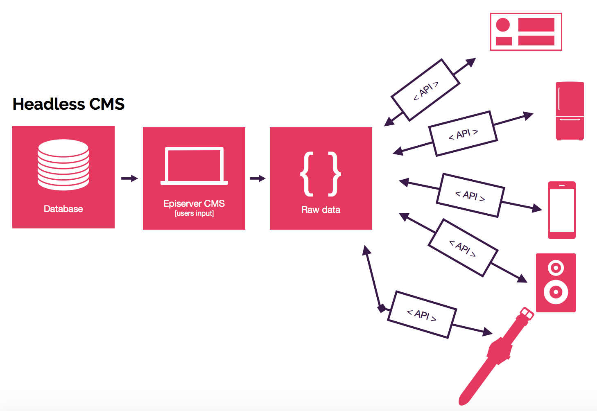

import styles from '../../styles/another.module.css'

A headless CMS is a back-end only content management system (CMS) built from the ground up as a content repository that makes content accessible via a RESTful API for display on any device.

# 7 Reasons to Consider a Headless CMS

There are many reasons for a business or an organization to consider a headless content management system (Headless CMS). Among them are a need to use content in multiple channels, a desire for improved customization, and relief from a cluttered, conventional platform.

How a business manages and stores content for products and articles is important. It impacts website and application performance as well as conversions. Thus, some businesses may want to look beyond a traditional CMS.

## Headless CMS

A headless CMS separates content production, management, and storage from distribution and display. This decoupling emphasizes creation, audience building, and business success.

Traditional Content Management Systems (CMS) such as Wordpress have taken a tight-coupled approach towards content storage and content delivery with the proliferation of several plug-ins and extensions that made the whole CMS scene very clumsy, very bulky and a real scary to get into it for a simple use case for content creation and content management.  So many moving parts made it even more difficult to maintain as it was not as easy maintaining code or documents in a Change Management System.

Typical use cases of Traditional Content Management Systems (CMS) has been content creation, content preview and content publishing, all steps linked within a single work flow that led to a tight coupling of the content creation with the content delivery (view or the presentation layer). 

That led to a tight coupling between the content creation and content publishing (viewing) and discouraged reuse of that content sitting in a database and thus restricting other use cases of content consumption.

With the advent of omni-channel user engagement and proliferation of Social Media as a primary mode of Digital Engagement with consumers, it has become essential for organizations to feed content (data) into all these channels. This is where the Headless CMS comes in as a perfect solution 

1. Headless CMS serves as a **central repository** for all the content needs of an organization such as Blogs, Social Media Posts, Application Content all API-driven from the cloud.
2. Headless CMS is designed to encourage content creation that is device for factor or UI **agnostic** but still allows for consumption using **only API** across various devices and channels that have their own view markup and render methods. 

3. **Non Technical** Users with basic Internet savvy and  Web Application skills can create, modify and deliver content of their choice without having to worry about how it is displayed.

4. **Content Reuse:** Content can now be heavily reused across a multitude of device form factors such as Mobile Smart-phones, Wearables including Smart Watches, Smart Displays and many more such device form-factors.

5. **Content-Mix**: Content stored in a central repository can be **injected** and mixed with secondary forms of content being created by an organization such as Blogs, Social Media Posts, White Papers and Web Pages etc.

6. **Integration:** With the content now available in a free and Open API format such as JSON/REST API, it is much more easier to consume this content via an API Endpoint and integrate it across a wide variety of Enterprise Applications both vertical as well as horizontal. The same API Endpoint can be used even in Customer facing B2C Applications such as E-Commerce Stores, via both Web and Mobile Apps.

7. **Performance:** With content taken off from the same block as the Application stack, the performance of the Web and Mobile Applications can be improved significantly by using latest Front-End Technologies such as ReactJS, ReactNative, GatsbyJS and AngularJS etc.

   
