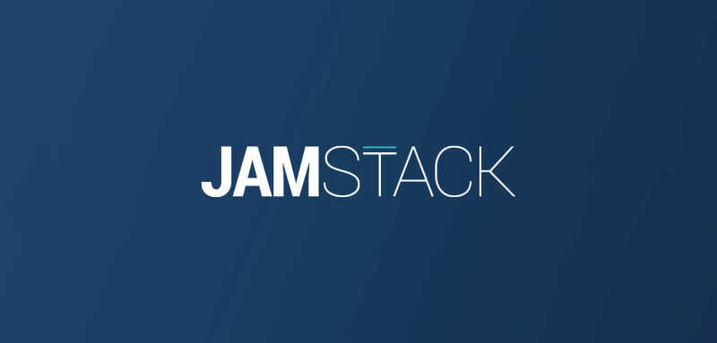

---
# This is the frontmatter which goes at the top of the MDX file
# Hashes in the frontmatter are comments
title: Building a JamStack Website 
author: Srikanth Jallapuram
date: 2020-07-11
featuredImage: ./modernweb.png
---

import styles from '../../styles/another.module.css'

 
 

# New to JAMstack? Everything You Need to Know to Get Started

When we first wrote this post about JAMStack, the [JAMstack](https://jamstack.org/) ecosystem was still in its infancy.

%20to%20Get%20Started%20-%20Snipcart_files/giphy.gif)

We are very happy to have been associated with the evolution of the JAMStack especially with the advent of powerful and efficient ReactJS based Static Site Generators (SSG) such as GatsbyJS and NextJS combined with various API powered Headless-CMS such as Contentful, Netlify-CMS, Strapi, DatoCMS, Directus etc.

We plan to keep up providing [valuable resources](https://www.heavybit.com/library/podcasts/jamstack-radio/) to new & seasoned JAMstack developers alike in 2020. It starts today with this update to our introduction post and what we think the year ahead has in store for developers.

We will cover:

1. [What the JAMstack is](#intro)
2. [How to get started with it](#getstarted)
3. [How to sell the JAMstack to clients](#clients)
4. [What are the best resources to stay up-to-date](#list)
5. [What the Snipcart team is expecting from the JAMstack in 2020](#conclusion)

## 1. What is the JAMstack?

### 1.1 Definitions

The JAMstack isn't a specific set of tools, but a new, modern way of building websites & apps. Where does J-A-M come from, you may ask? From these three core concepts:

[**JavaScript**](https://snipcart.com/blog/why-javascript-benefits): Any dynamic programming during the request/response cycle is handled by JavaScript, running entirely on the client.

**APIs**: All server-side functions or database actions are abstracted into reusable APIs, accessed over HTTPS with JS. Be it SaaS, third-party services or custom-built.

**Markup**: Templated markup should be prebuilt at build time, usually using a site generator for content sites, or a build tool for web apps.

Great. But what does it all mean in practice?

For a long time, using a coupled CMS was the norm: it organized development efforts and gave clients the autonomy to manage their site.

But that was 5+ years ago.

Countless developers have since felt the pains of working with CMS.

We became aware that traditional CMSs (WordPress, Drupal) were just trying to do **too much**.

We realized how cumbersome they were. How opinionated. These user-friendly admins started feeling less friendly.

Thanks to modern browsers, static site generators, [CDNs](https://en.wikipedia.org/wiki/Content_delivery_network), and APIs, we are now seeing web developers transition from dynamic server-side applications to modular, client-side stacks.

[JAMstack is a significant shift in focus from the now abstractable backend to the now powerful frontend.](https://twitter.com/intent/tweet?text=JAMstack%20is%20a%20significant%20shift%20in%20focus%20from%20the%20now%20abstractable%20backend%20to%20the%20now%20powerful%20frontend.&hashtags=jamstack%2Cwebdev&url=https%3A%2F%2Fsnipcart.com%2Fblog%2Fjamstack&via=snipcart)

For those new to the concept, here are the [best practices defining](https://vimeo.com/163522126?cjevent=739c2bd5136411e983c200840a240610) a JAMstack project:

* Entire site/app on a CDN
* Atomic deploys
* Instant cache invalidation
* Everything lives in Git
* Automated builds

But it did not come to life with just the snap of a finger. Like I said at the beginning, it's been a few years in the making.

### 1.2 Timeline

Let us take a quick journey back in time with a year-by-year view of the rise of the JAMstack. It should clarify where its at right now and where it is going.

â†' **2015**: Static sites are slowly making a comeback from the ruins of the web's early years. The first CMS-deniers are making them cool again.

â†' **2016**: As you would expect, backlash occurs. Static sites aren't cool at allâ€"they lack too many features to build anything other than blogs. In the meantime though, a small group of developers is coining the JAMstack and slowly promoting its principles in modern dev circles.

â†' **2017**: The year JAMstack really comes to life, for a somewhat niche community. Static sites aren't static anymore. This modern web revolution gives you all the features you need to build “hyper-dynamic sites & apps. Sequoia Capital, Mailchimp & Red Bull are a few of the first big enterprises to build JAMstack projects.

â†' **2018**: Here is a phrase we start to hear a lot: “Just discovered the JAMstack and, oh my God, it's amazing? Yup, the paradigm makes a mainstream breakthrough with more & more people talking about it. Substantial funding is announced for tools like Gatsby, Netlify, Contentful, etc. The first [JAMstack_conf](https://jamstackconf.com/) takes place.

â†' **2019**: The year of maturity & accessibility. The JAMstack isn't a niche community anymore. Most frontend developers hear about it and many start looking into it. With the likes of [Stackbit](https://www.stackbit.com/), the JAMstack opens its doors to [less technical users](https://snipcart.com/blog/manage-jamstack-websites-stackbit). The rise of [serverless functions](https://snipcart.com/blog/why-serverless-example) is also huge for bringing more backend functionalities to frontend-centric projects.

â†' **2020:** With a new decade on the horizon, there is nothing indicating a decline in the JAMstack's adoption. If services and APIs in the ecosystem continue to prove viable and profitable, we will see more important players embracing the idea, increasing adoption even more. The New Dynamic brought legit concerns about having **too much** options in the ecosystem in its [first newsletter of the year](https://www.thenewdynamic.org/article/2020-11-01-jamstack-update/). Food for thought, no doubt. Otherwise, I’d say the future looks bright for JAMstackers! More insights for 2020 coming in the last section of this post.

We can claim with confidence that there is a serious revolution happening in the web development universe. The traditional approach that has ruled for more than a decade isn’t the only player in the game anymore.

And its all for the best.

### 1.3 Workflow comparison (JAMstack vs. traditional)

Here's a quick primer to understand key differences between the two approaches:

This graphic is a very stripped-down view of what is actually going on under the hood. Here is what it looks like when you zoom in:

**Traditional workflow**

â†' Building and hosting are coupled.  
â†' A user requests a page. The file gets processed and served following a (long) series of interaction between a database, backend code, server, browser, and layers of caching.  
â†' Core updates are pushed to production servers, often through FTP. Database must be maintained or updated.  
â†' Content updates are pushed through traditional CMS, like WordPress or Drupal.

**JAMstack workflow**

â†' Building and hosting are _decoupled_.  
â†' A user requests a page. The file is already compiled and gets directly served to the browser from a CDN.  
â†' Core updates are pushed through Git; the site gets re-built entirely via modern build tools like static site generators.  
â†' Content updates are pushed through Git or a static site CMS.

### 1.4 Benefits for developers

We often break down JAMstack benefits in four main categories: better performance, higher security, cheaper scaling & better developer experience.

How so?

* The delegation of server-side & database operations **removes lots of points of failures & security exploits.**
* The static content served via CDN **makes for extra speedy user experiences.**
* The lesser complexity of development **reduces costs.**
* The reduction of bloat & maintenance + refreshing flexibility in workflows **diminishes depression and alcoholism among developers.*

Jokes aside, there’s plenty of value in the JAMstack approach, for developers and clients alike. I’ll emphasize the client part later on. First, developers need to know how to get started.

## 2. Getting started with the JAMstack

If you are new to this whole idea of the JAMstack, you might be a little overwhelmed at this point. Knowing where to start is sometimes the hardest part.

First, remember that we’re talking about frontend-centric development here. If you’re new to web development in general, you’ll want to make sure to sharpen your [JavaScript skills](https://snipcart.com/blog/javascript-beginner-intro-exercises). Then learning as much as you can [about APIs](https://snipcart.com/blog/apis-integration-usage-benefits) will allow you to push your projects to the next level.

Once you've got this covered, well, the sky’s the limit as they sayâ€"as long as you can find the tools to match your ambitions.

### 2.1 New projects

Starting from scratch is the best way to build a pure JAMstack. This way you can really choose all the necessary pieces to create what you want. As I explained earlier, building and hosting are decoupled. The first thing you’ll want to decide is **what to use to build your site/app**.

The modern frontend ecosystem may make your life hard here. Not because of a lack of relevant tools. Actually, its just the opposite! There are hundreds of possibilities, even if some clearly stand out.

**JavaScript frontend frameworks**

JS is everywhere nowadays and nowhere is it more noticeable than in the evolution of these frameworks in the last few years. They’ve transcended the world of browsers to become the go-to for [single-page applications](https://snipcart.com/blog/vue-js-seo-prerender-example) (SPA), [progressive web apps](https://snipcart.com/blog/pwa-example-ecommerce-gatsby) (PWA) and mobile apps everywhere. The Holy Trinity of JavaScript frameworks is still where you should look at for getting started: [React](https://reactjs.org/), [Vue](https://vuejs.org/) & [Angular](https://angular.io/).

Just like I would recommend [learning JavaScript’s basics](https://snipcart.com/blog/learn-vanilla-javascript-before-using-js-frameworks) before frameworks, I would also recommend learning these frameworks before jumping into building tools (like SSGs) written on top of them.

Oh, and in 2020, maybe also keep an eye on [Svelte](https://svelte.dev/)? This relatively new framework follows in the footsteps of React & Vue, while creating its own path looking forward. Svelte acts as a compiler. It ditches the _virtual DOM_ and compiles components into JavaScript, resulting in much lighter weight and boosting performances.

**Static site generators**

Simply put, an SSG takes your site content, applies it to templates, and generates a structure of purely static HTML files ready to be delivered to viewers.

These popular JS frameworks I was just mentioning gave birth to some of the most powerful static site generators out thereâ€"Gatsby & Next.js for React, Nuxt & Gridsome for Vue. These are the ones that are currently bringing SSGs to whole new territories.

> There are many others obviously, and they all have their appropriate use cases. We’ve made [this resource](https://snipcart.com/blog/choose-best-static-site-generator) to help developers find the right one for their needs.

What we’re seeing right now is less of them being created and the top players getting more mature. Gatsby, for instance, has grown considerably in the last few months and is still going strong. Is 2020 the year where we’ll see [incremental builds](https://www.gatsbyjs.org/blog/2019-06-12-performance-improvements-for-large-sites/#first-step-towards-incremental-builds) being supported? We sure hope so.

Good news for Angular developers: the [first static site generator powered by Angular](https://snipcart.com/blog/angular-static-site-generator-scully) is finally here! [Scully](https://github.com/scullyio/scully) will certainly be a tool to monitor in the upcoming months. It means that all the major frontend frameworks now have their JAMstack tooling, leaving even more freedom for developers to work with the tools they love.

Another one that is getting a LOT of love by the community, from what have been reading, is the JS-powered [11ty](https://www.11ty.dev/). You can read more about this SSG [here](https://snipcart.com/blog/11ty-javascript-static-site-generator-tutorial).

**Headless CMS for backend functionalities**

Content Management Systems are really great for a few things: manage user permissions, editor roles and, obviously, content. So why not use them _only_ for these tasks? That’s exactly what headless CMSs doâ€"finally decoupling the backend administrative tasks from frontend views.

Most headless CMSs will fit with whatever frontend tech you’re using, while others are built to work primarily with specific tools. Newer CMSs even allow for [built-in static site generation](https://snipcart.com/blog/publii-static-cms-html). However, just like SSGs, there are enough of them to find the right one for you, no doubt.

> [Here’s something](https://snipcart.com/blog/headless-ecommerce-guide) that should guide you through this quest.

**Deployment**

Once you have built your site/app, it needs to live somewhere. Most developers turn to [GitHub pages](https://github.com/), [Netlify](https://www.netlify.com/) or [Zeit](https://zeit.co/) to host their code.

**So here is a few use case examples of what your new stack could look like:**

â†' _If you’re only creating a small blog for yourself_, why not use [Hugo to generate](https://snipcart.com/blog/hugo-tutorial-static-site-ecommerce) the site, deploy it on Netlify, and use Netlify forms/[Staticman for comments](https://snipcart.com/blog/staticman-dynamic-content-static-website). For content management and editing purposes, plugging a headless CMS (e.g. [Ghost as a headless CMS](https://snipcart.com/blog/ghost-demo)) will make the life of less technical users easier. For blogs, there's definitely no shortage of cool options!

â†' _If you’re building an enterprise, highly dynamic app with SEO needs_, why not use [Next/Nuxt.js for statically rendered apps](https://snipcart.com/blog/react-seo-nextjs-tutorial) in the front, with [Contentful](https://www.contentful.com/blog/2016/02/10/snipcart-middleman-contentful/) as a CMS pushing your content to various platforms (PWA, desktop, web-app, etc.).

â†' _If you’re building an online shop for a client_, why not prioritize performance with statically generated files ([with,](https://snipcart.com/blog/jekyll-ecommerce-tutorial) say, Eleventy!), add a lean content management system with, say, DatoCMS or Forestry, and plug in a simple yet customizable e-commerce solution like Snipcart [Shopping Cart](https://snipcart.com/jamstack-ecommerce).

â†' _If you are crafting documentation to support a new project_, why not go [the same way we did](https://snipcart.com/blog/generate-documentation-javascript) crafting auto-generated docs thanks to the excellent mix of Nuxt & Sanity. We truly fell in love with these tools and are looking forward to leveraging them again in the future (the next version of our marketing website, maybe?).

This whole process provides great flexibility and a renewed sense of fun for seasoned developers. Got to admit though, it’s quite hard to sell to newbies. Ease of adoption is something the JAMstack community has been striving to achieve for a long time now.

The arrival of tools such as the [Stackbit site builder](https://app.stackbit.com/edit/5e1f86692414200019b1f205/theme) opens up this new era for the JAMstack. What it does is provide an interface for assembling a frontend stack, without complicated integrations.

### 2.2 Migrating or refactoring existing projects

Frontend refactoring has never been simpler and more of a progressive process thanks to modern frontend frameworks. We’ve gone through it, iteratively migrating our old Backbone architecture to Vue.js. And [we loved](https://snipcart.com/blog/progressive-migration-backbone-vuejs-refactoring) every part of this operation.

It's also true for the backend. I know that a lot of developers who used to work with WordPress and other monolithic CMSs are starting to eye the JAMstack with curiosity. Well, it’s getting easier to migrate traditionally built projects to more modern infrastructure.

SSGs like Jekyll offers an easy way to migrate CMS data thanks to [_importers_](https://import.jekyllrb.com/). The same can be said about headless CMSs such as [Contentful](https://www.contentful.com/blog/2015/03/09/exporting-content-from-wordpress-drupal-or-elsewhere-and-importing-in-contentful/) and [DatoCMS](https://www.datocms.com/blog/wordpress-importer/)â€"they ease the move from traditional systems to headless ones.

But what if you could actually make it even easier:

Use a good ol' traditional CMS as a backend UI, strap a JSON/REST API on top of it, and use your favorite frontend tools to render static HTML to browsers. This way, you can easily reuse data from an ongoing WordPress project, for example, and attach it to a whole new JAMstack.

Both [WordPress](https://wordpress.org/plugins/rest-api/) & [Drupal](https://www.drupal.org/docs/8/core/modules/rest/overview) now allow you to do that [headless setup](https://snipcart.com/blog/reactjs-wordpress-rest-api-example). It looks like even the big players are taking modern frontend development very seriously.

Pantheon, the website management platform for devs, has lots of resources on decoupling traditional CMS. If you're interested, [start here](https://pantheon.io/decoupled-cms).

### 2.3 Added functionalities/third-party services/SaaS

JAMstack sites being built today are more hyper-dynamic than _static_. [The current API economy](https://www.programmableweb.com/apis/directory) and explosion in SaaS offers an interesting _Ã la carte_ approach. In other words, you can cherry pick the dedicated external services you need and adopt a truly modular development stack. Whatever dynamic information you need to handle, there's probably something just for that:

* Webtasks and Serverless can handle multitudes of backend functions for you.
* Snipcart,[Foxy.io](https://snipcart.com/blog/foxy-vs-snipcart-review), Moltin and Shopify’s Buy Button can handle e-commerce.
* FormKeep,[Typeform](https://www.typeform.com/), Formspree, and even Netlifyâ€"on top of building, deploying, and hosting your projectâ€"can handle form submissions.
* Algolia, Google Custom Search, Fuse.js, Lunr.js and List.js can handle search functionality.
* Disqus and [Staticman](https://staticman.net/) can handle user-generated content like comments & reviews.
* [Cloudinary](https://cloudinary.com/) can manage, optimize and deliver image and video content.
* [Auth0](https://auth0.com/) can handle authentication and authorization for web and mobile apps.

And the list goes [on](https://www.thenewdynamic.org/tools/) and [on](https://github.com/agarrharr/awesome-static-website-services).

## 3. Making clients feel the JAM

%20to%20Get%20Started%20-%20Snipcart_files/giphy-downsized.gif)

Developers aren’t alone in this new paradigm: **clients** are still at the center of most projects. Of course, you’ll get eager head nods from developers when you mention how the JAMstack erases the need for complex dynamic caching. Clients though? That’s not how you’ll get them excited.

Because it is just not their lingo.

_So how can you make clients understand the benefits of switching to a JAMstack setup?_

### 3.1 Turning technical features into business benefits

The short answer is to speak your client’s lingo. To _vulgarize_ and _show_. I for one like to break down technical features and turn them into tangible business benefits.

Let’s take the removal of database queries, and the CDN-based content serving for instance. We can boil this down to **performance**. How can that have _meaning_ for a client?

Well first, you could pop up a site speed test app like [Pingdom](https://tools.pingdom.com/) or [PageSpeed Insights](https://developers.google.com/speed/pagespeed/insights/) and bring up two very similar sites (or the same one)â€"one static, one dynamic. You'd make sure the client _sees_ the difference in results. You can then explain to the client how crucial page load time has become for on-site engagement [and SEO](https://www.semrush.com/blog/why-does-page-speed-impact-your-seo/). Simple association follows:

Now for the withdrawal of server-side parts, which epitomizes the **reliability** argument. You could explain that a dynamic site is like a six-story house of cards, more vulnerable to collapse because it has more parts, more complexity to its structure. A static site, on the other hand? Make it a 1 story house of cards.

Super easy to build and maintain. :)

And last but not least, you could translate reduced operational and development costs into hard savings:

By ditching the big web server, the databases, the plugins, and the constant maintenance, it will easily save you X thousands of dollars a year.

Hard to argue with that.

### 3.2 Refuting common objections

The JAMstack isn't bulletproof yet. While discussing a switch to it, more tech-savvy clients or developers may bring up some (more or less) legitimate concerns. Here are the two objections we used to see frequently in online threads that could still come up in conversation:

**1) A JAMstack set up is nice, but I need to handle dynamic features on my site.** I'll repeat it one last time: the JAMstack sites built today aren't static anymore. They are hyper-dynamic. So regarding the presumed lack of server-side features, you should refer to the section about added functionalities & third-party APIs.

**2) Static CMS are cool and all, but I also need to manage user permissions & editor roles.** Remember the parts about headless & decoupled traditional CMS? Well, there was your answer to these concerns.

I know this isn't as sexy as a full suite of shiny new tools. And yes, it defeats parts of the purpose to adopt a full JAMstack. But it might just do the trick for your administrative needs! It could also significantly alleviate migration costs if all the content already exists in a traditional CMS.

Plus, with the extensive offer in headless CMSs and serverless functions, there’s practically no backend functionalities that are off-limits anymore.

## 4. Curated list of resources

If you want to keep up with the quickly evolving JAMstack ecosystem, or even contribute, here are a few resources to keep an eye on:

* [The New Dynamic](https://www.thenewdynamic.org/)
* [JAMstack radio](https://www.heavybit.com/library/podcasts/jamstack-radio/)
* [Netlify’s blog](https://www.netlify.com/blog/)
* [Alligator.io](https://alligator.io/)
* [JAMstack.org](https://jamstack.org/resources/)
* [Stackbit’s blog](https://www.stackbit.com/blog/)
* [That’s My JAM…stack Podcast](https://thatsmyjamstack.com/)
* [StaticGen](https://www.staticgen.com/)â€"a full list of available SSGs
* [HeadlessCMS](https://headlesscms.org/)â€"a full list of available headless CMSs

 And [our blog](https://technovature.com/blog/), obviously! Make sure not to miss anything by [subscribing to our newsletter](https://us5.list-manage.com/subscribe?u=c019ca88eb8179b7ffc41b12c&id=3e16e05ea2). And you should follow #jamstack on Twitter!

### Contribute to the JAMstack!

There are many ways you can contribute to this web revolution:

* Contribute to open source repos you love or want to learn. There are dozens of SSGs, headless CMSs, and third-party services waiting for developers to lend a hand.
* Build a personal or side project with the JAMstack.
* Write an article or craft a video showing how you used the JAMstack for XYZ project. Platforms like [dev.to](https://dev.to/) or [DailyJS](https://medium.com/dailyjs) let devs share helpful content.
* Support industry players you love by sharing their content or using their products.
* Attend the [JAMstack Conf 2020](https://jamstackconf.com/)! It takes place in London on May 27-28th and in San Francisco on October 6-7th.

At Technovature, we are always open to relevant guest posting from devs with killer content to share! Let us know if you are interested.

## 5. Closing thoughts

Feel free to start the conversation right here in the comments. Where's your head at when it comes to the JAMstack? Are you all in? Still having doubts? What are you looking for the most in the ecosystem in 2020? We'd love to read your opinion.

I'll end this (long) post on a more personal note. As a team and a business, we are still 100% behind the JAMstack and constantly in awe of the expansion it has been through in a short amount of time. Here are rapid-fire thoughts coming from the Technovature team members:

Let's hope 2020 (oops?), actually 2021 meets our expectations! In the meantime, happy coding to you all. :)

***
