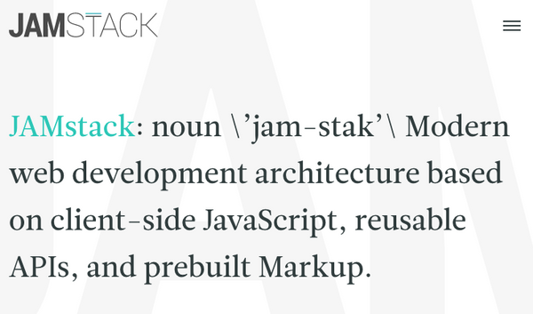

---
# This is the frontmatter which goes at the top of the MDX file
# Hashes in the frontmatter are comments
title: What is JAM Stack 
author: Srikanth Jallapuram
date: 2019-02-05
featuredImage: ./jam1.jpg
---

import styles from '../../styles/another.module.css'

[#javascript](https://dev.to/t/javascript) [#gatsbyjs](https://dev.to/t/gatsbyjs) [#react](https://dev.to/t/react)

## JAM Stack

JAM stands for ***Javascript, API and Markup***, an acronym with a nested acronym. 🤓

[jamstack.org](https://jamstack.org/) defines JAM as *modern web development architecture based on client-side JavaScript, reusable APIs, and pre-built Markup.*

Defining what JAM means doesn't really gives us enough depth though, is there any secret behind it?

Let's take a look at the file structure for an example JAM website:

As you can see, there's no magic behind it. Just a set of files that we're all used to seeing in the front-end aspects of our projects

Based on that file structure some could even try to argue that [Space Jam's website](https://www.warnerbros.com/archive/spacejam/movie/jam.htm) is a JAM site (spoiler: it isn't, it doesn't even use CSS 😂).

The diagram below outlines the differences between traditional web architecture and JAMstack web architecture.

The key difference is the reduction in server-side complexity, removing the need for a tightly coupled Web Server and App Server, as well as the Database and/or Content Management System (CMS). Instead, the focus shifts to “client + services”, where the main web application can be distributed globally via a Content Delivery Network (CDN) and (where required) interacts with discrete services directly from the client via APIs.

The JAMstack web architecture is made possible, thanks to the advancements in web browsers, which today are comparable to full operating systems (e.g. [Chromium OS](https://www.chromium.org/chromium-os)), capable of interacting with countless APIs and running complex applications client-side. This, alongside the rapid growth of JavaScript front-end development (e.g. React) and comprehensive build tools (e.g. Gulp), can make traditional web architecture obsolete for certain scenarios.

The diagram below provides a deeper look at the JAMstack web architecture, highlighting the developer experience.

Static site generators (e.g. Jekyll) and build tools (e.g. Gulp), provide a mechanism to automatically build web applications locally, producing a set of easy to cache static assets. These static assets can then be deployed via a simple “Git Push”, following a traditional Continuous Integration / Continuous Deployment methodology.

If we look at one example of a JAM website built using [Gatsby JS](https://www.gatsbyjs.org/), [Rachio Smart Sprinkler](https://rach.io/store/), we can see that for the end user, there are no immediate visual changes, this website is statically built and still offer full e-commerce and checkout journeys, with the help of APIs.

## Why should I give myself the trouble?

Even if the end user won't really have any immediate advantages, there are a number of reasons that will encourage you to consider the JAM approach on your next project. Let's visit some of them:

### Load speeds

**No database querying**: As your website's markup is built on build time, there is no database queries being done at every page request. This saves both on server load as well as overall response times.

**No template parsing**: Depending on your stack, chances are you have a template file in your code base that gets parsed and is used to build the HTML that gets sent back to the browser on every page request. With a static site that wouldn't happen, meaning you can also save on server loads and response time by taking this aspect out of the request/response flow.

### Separation of concerns

**Front-end takes care of all presentation**

With front-end frameworks increasing in popularity and capabilities, having your website/application's presentation decoupled from any backend framework means you can harness all the power that your front-end stack gives you, and in turn deliver a better experience to your end users.

**Centralised/focused UX design**

Equally relevant, if you don't need to worry about how the backend of your application handles its data and business logic, you can focus more of your efforts ensuring that your user experience is at the level you want and your end users expect, without have any potential constraints imposed by backend solutions.

### Frequency of content update

**How often do we really update ALL our pages?**

This is a point that is very often overlooked. For a number of our pages, content is rarely ever updated, eg contact pages, terms and conditions, blog posts.

You may update such pages a few times soon after they're published to fix potential typos or inconsistencies but once that period is gone chances are you will never edit that page again so why not have it statically built and save your server the hassle of having to compile this page on every request?

**Frequently changing content can use APIs**

If you have pages that still need to provide dynamic or time sensitive content, you can use APIs to update that content once the page has loaded and maybe cache that content on the client-side or (less optimal) include that content after the page has loaded.

### No need to implement everywhere

There is no need to move your entire application to JAM all at once.

**JAM Stack your blog**

As mentioned above, certain pages are less likely to change after they've been published so making them static would provide you with increased performance and better experience for end users.

**User authenticated areas could remain non-JAM'd**

If your application has some sort of authenticated area where things need to be kept dynamic, you can skip that section when *JAM'ing* your application.

**Progressive migration to JAM**

The takeaway from this section is that you can slowly migrate your content to a static build, and bring in more API backed dynamic content as you identify the opportunities in your application for a JAM approach.

### Tie in with service workers, SPA's and animated page transitions

JAM stack makes it easier for us to include new web workflows onto our applications, such as [Service Workers](https://developer.mozilla.org/en-US/docs/Web/API/Service_Worker_API), single page application frameworks and animated transitions between pages.

**Offline support**

With service workers you can make some or all of your website's content available to users when they're offline. This is a great feature, but specially important if your core market involves tourists or users with less than optimal internet connections.

**Push update to service workers on build time**

As I said earlier some pages would rarely change their content after being published, but when they do, you can use service workers to revalidate your content based on your needs. This will ensure your end users always have the most relevant content on their devices.

**Page transitions make UX sleek (like on native apps)**

This may not seem like a key feature of static and JAM based sites, but if you take a moment to think about how nice some native apps transitions between their different areas, it is really exciting to think that we can do the same on a web based application. See [Sarah Drasner](https://t.co/pr1NhYseRK)'s [page transitions](https://page-transitions.com/)example if you need some inspiration.

### Caching

Lastly, caching a statically built site is even more efficient than a dynamic one as you can cache all aspects of your site and depending on your content type your cache can be set to extremely long expiry dates.

For any portions of your site that need to be dynamic, you can use the Javascript and APIs aspect of JAM to pull in content after the page has loaded.

### Security

Static assets offer the highest level of security for web applications, due to the fact they do not require databases, plugins or execute dynamic code server-side. Any required server-side processes are abstracted into service APIs, called by the client, which significantly reduces the attack surface. Traditional web applications often require server-side plugins (e.g. Wordpress) to operate, which are extremely vulnerable and require continuous maintenance.

### Automation

Workflow is highly automated through the use of modern static site generators and build tools, with deployment occurring via a simple “Git Push”. This approach results in loose coupling and a clear separation of concerns, delivering a simplified development and debugging environment.

### Cost

Static assets are simple to host, as they do not require complex server-side configuration. This simplicity ensures a highly competitive market and therefore very aggressive pricing (even free).

## Caveats

As with most things in our area, there can also be trade-offs or at least things that you should keep in mind when crafting your JAM based application. I already touched on these above but for the purpose of having all of these under one section, a few caveats to consider when building JAM apps are:

**E-commerce and extremely time sensitive content**

If your content is extremely time sensitive and relies heavily on a backend solution, JAM may not be the best option. One way to circumvent this would be to use APIs to update the content on the front-end, but this may not be possible all the time.

**Must implement SSR**

There are many reasons behind this, but it's always recommended that you implement some sort of server side rendering logic at least at build time, for your content.

**Ensure no JS support if relevant and SEO best practices**

I know this may sound a bit dated, but implementing no JS support can be very relevant depending on your target audience or the percentage of users you want to deliver your application to. It's worth mentioning that no JS support could be slightly limited when compared to the full application, but it's important to give no JS users at least some sort of consistent experience.

Depending on the type of website or application you will also want to ensure that you're covering your grounds in terms of SEO. Having a great website could mean nothing if no one can find out about it.

**Authenticated areas of your app**

Authenticated areas of your site may not always be compatible with the JAM approach. Again, APIs can help you here, but it's up to you to make that call for each individual case.

A few suggestions on this would be to SSR the chrome of your site, and maybe add some placeholder markup to indicate that the user specific content is still being fetched with AJAX/APIs.

## How can I join the JAM Stack hype train?

Now that you have seen some pros and cons of JAM, you may want to try it out for yourself. There are plenty of ways you can build a JAM based website and most of these have some sort of static site feeling to them.

I compiled a list with some options you could try, but this is by no means a comprehensive list, just things that I came across or used myself in the past.

[**React JS**](https://reactjs.org/)

React is probably the most widely used front-end framework these days and if you know React you probably know all these options. Either way, these are a few tools that you can use to build a JAM stack:

- [create-react-app](https://github.com/facebook/create-react-app): Great zero config React application scaffolder with the possibility to *eject* your app once more custom features are needed.
- [GatsbyJS](https://www.gatsbyjs.org/): A static site generator for React with a built in GraphQL data layer and the ability to built static HTML from your React components on build time.
- [Next.js](https://nextjs.org/): A framework for server-rendered React applications with support for static sites.

[**Vue.js**](http://vuejs.org/)

Vue is also a front-end framework that has been increasing in popularity and adoption very quickly. If you're using Vue, these are a few of the tools you can use to build JAM apps:

- [Nuxt](https://nuxtjs.org/): Universal Vue JS application framework, often said to be the Vue equivalent of Next.js,
- [VuePress](https://vuepress.vuejs.org/): Static site generator for Vue.
- [eagle.js](https://github.com/Zulko/eagle.js): A hackable slideshow framework built with Vue.js (used to create my talk's slides 🤓).

**Other options**

- [Jekyll](https://jekyllrb.com/): Ruby based static site generator, widely used for [GitHub Pages](https://pages.github.com/).
- [Hugo](https://gohugo.io/): Go lang based static site generator.
- [StaticGen](https://www.staticgen.com/): StaticGen offers a list of static site generators that you can sort and filter based on your preference or needs.
- Build your own: [NIH syndrome](https://en.wikipedia.org/wiki/Not_invented_here) aside, if you have a very specific set of features that you require, you can always build your own static markup and integrate it with your APIs in a way that suits your business and needs.

## JAM friendly backend solutions?

One other important aspect of JAM stack is ensuring that your backend solutions integrate well with front-end frameworks and provide APIs that you can harness from the front-end/client-side of your application. A few examples of frameworks and services that can help you with that are:

- Headless WordPress: Using WordPress as your CMS doesn't necessarily mean you need to use it to generate your website's markup directly. API-first/Headless WordPress is something that is increasing in popularity and plugins and libraries to help you get started are out there.
- [Netlify CMS](https://www.netlifycms.org/): A file based CMS that can plugin in directly into your version control and build workflow.
- [Prerender](https://prerender.io/) : SEO friendly plugin to your application that ensures your website can be crawled correctly by search engines
- Your current framework of choice: This may not be as obvious for all CMS/frameworks but chances are you can already build a JAM website and integrate with your current backend solution, possibly by using REST and/or GraphQL.

## Conclusion

Thanks for reading my post. JAM stack is awesome and I believe it's the most efficient way forward for us. When you get to your next project, consider giving JAM stack a try, or maybe consider rebuilding portions of your current set up using JAM, you won't be disappointed. 😉
