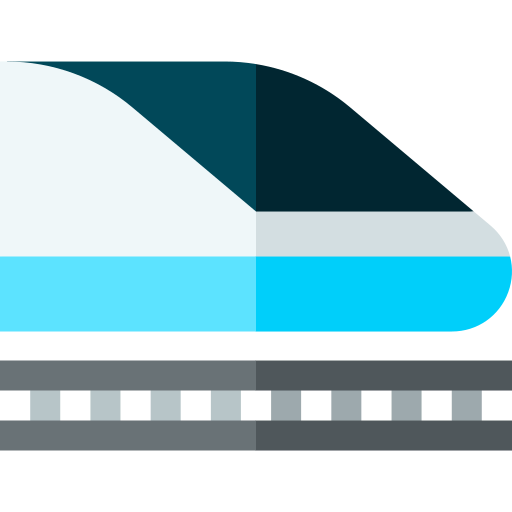
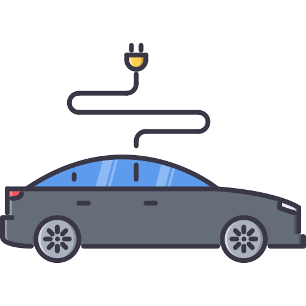
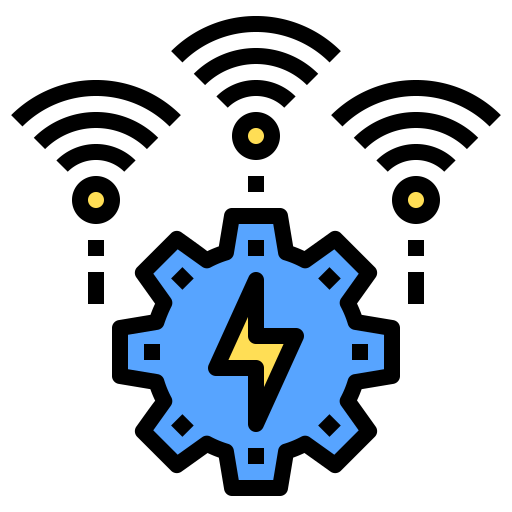

---
# This is the frontmatter which goes at the top of the MDX file
# Hashes in the frontmatter are comments
title: 5G Services 
author: Srikanth Jallapuram
featuredImage: ./5G.jpg
---

import styles from '../../blog/ai-chatbot/another.module.css'
import './5g.css';

Harness the power of 5G networks with our innovative software development services and solutions development services to build innovative 5G powered applications and solutions, develop network technology, build 5G solutions and innovate within your industry.

> 5G Networks Will Cover 40% of the World by 2024, Handling 25% of All Mobile Traffic Data

The next generation of mobile networks feature unlimited capacity, minimal latency for real-time services, low power consumption, almost 100% availability and the opportunity to connect millions of devices – unleashing countless opportunities for your business.

We can help you get ahead in this 5G-enabled world with our solid telecom engineering experience delivering wireless, networking and cloud projects. Work with us to accelerate your technology journey, enhance and or augment your solutions development capabilities from research and labs right through to commercialisation.

# Why Should we be excited about 5G 
 

 

<h3 style="text-align:center"> High Data Rates </h3>

 1 Gbps for hotspots, 100 Mbps download and 50 Mbps upload for wide-area coverage 

 

<h3 style="text-align:center"> Massive Connectivity </h3>

 Up to 1 million connections per square kilometre 

 

<h3 style="text-align:center"> Ultra Low Latency </h3>

 Less than 1 ms low-latency for interactions 

 

<h3 style="text-align:center"> High Reliability </h3>

 99.999% for mission critical ‘ultra-reliable’ communications 

 

<h3 style="text-align:center"> High Speed Mobility </h3>

 Up to 500 km/h i.e. communications possible inside high speed trains 

 

<h3 style="text-align:center"> Always On Real-Time </h3>

 Up to 500 km/h i.e. communications possible inside high speed trains 

# Our 5G Solutions and Services 

	

 

<h3 style="text-align:center"> Autonomous Vehicle Technology </h3>

We are working at the intersection of 5G and autonomous connected technologies. Unified 5G connectivity slowly but surely seems to make the Level 5 Automation for Autonomous (Vehicle) Driving a Reality along with ubiquitous possibilities in V2X technology spearheaded by ITS-G5 VS Cellular V2X with enhanced Real-Time on-board Intelligence inside the car/vehicle.

 

<h3 style="text-align:center"> Smart Cities </h3>

We are moving to the next phase of Smart Cities development with 5G finally enabling a true integration across myriad of Smart City Applications such as  Smart Home, Smart Transportation, Smart Grid, Smart City Security while fostering economic growth, improved quality of life, better environment, safe environment and better communication.

 

<h3 style="text-align:center"> Drone &amp; UAV Technologies </h3>

Our expertise in advanced drone development is now taken further with 5G enabled drones having a much greater connectivity and lower latency allowing for a greater precision in manoeuvring and the quick transfer of high-precision data. In particular, the use of 5G as a direct, or back up communication infrastructure, will enable drones to always stay connected.

 

<h3 style="text-align:center"> AR &amp; VR Technologies</h3>

Our expertise in iOS and Android based AR/VR technologies is further pummeled with the push of 5G that will make VR and AR a reality for the world. with almost no latency, improved connection, increased traffic capacity, more bandwidth means better screen and equipment quality. For mass adoption of VR and AR tech, 5G will need to be adopted first.

 

<h3 style="text-align:center"> Smart Healthcare </h3>

The healthcare industry is moving fast toward a complete digital environment with 5G enabling the Massive Internet of Medical Things (IoMT). Breakthrough innovations, such as continuously monitoring of all-vitals of patients through multisensory environments, teleporting doctors to a virtual environment for remote haptic interactions with their patients, performing technology-enabled remote surgeries or leveraging artificial intelligence (AI) to explore, compare sensory data and generate new medical insights are all now possible.

 

<h3 style="text-align:center"> Industry 4.0 </h3>

 Adoption of 5G in Industry 4.0 as proposed by 5G-ACIA can enable new operating models for Industrial Automation by leveraging and interconnecting the emergence of cyber-physical systems, advances in component technologies as in IIoT to machine vision, AI, Robotics and Software-driven operating processes all working in tandem can realize the vision of the "factory of the future".

