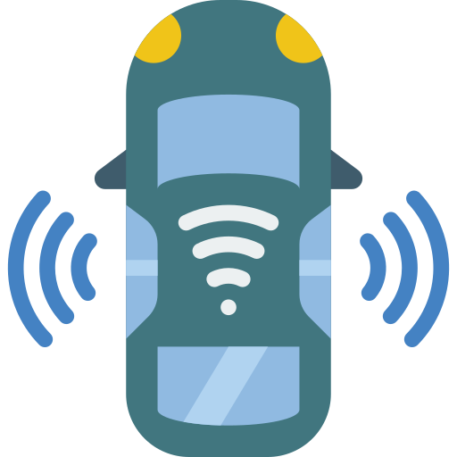
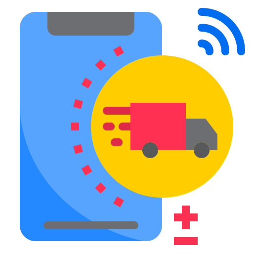
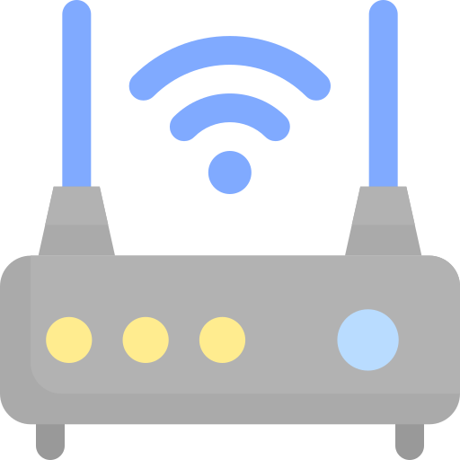

---
# This is the frontmatter which goes at the top of the MDX file
# Hashes in the frontmatter are comments
title: Autonomous Technology 
author: Srikanth Jallapuram
featuredImage: ./autonomous.jpg
---

import styles from '../../blog/ai-chatbot/another.module.css'
import './autonomous.css';

> The concept of human mobility is being engineered in alignment with the human experience.

Our Innovation in Connected Car and Autonomous technologies is driven by a solid confluence of maturing of technologies in the areas of sensors, in-car and on-board digital diagnostics, internet of things, machine-to-machine, artificial intelligence, highly precisee mapping and navigation and finally by the cloud computing technologies. All these technologies have influenced heavily in building the car of the future, which is electric, completely digital in nature and autonomous in many cases.

> 5G NR – standalone or SA – mode rollout, which promises lower latencies, will be critical for creating an inflection point in the commercialisation of autonomous cars later in the next decade

# Our Connected Car Technology Services 
 

 

<h3 style="text-align:center"> Digital Cockpit Solutions </h3>

 
Our automotive digital cockpit development team uses modern software development practices for fast prototyping, agile iterations, DevOps and Continuous Integration (CI) and Continuous Development (CD). Using the latest UX frameworks and SW platform expertise allows you to create unique, cutting-edge user experiences.

 

<h3 style="text-align:center"> Connected Car Engineereing </h3>

 Our connected car engineering services includes solutions around car music and audio, smartphone apps, navigation, roadside assistance, voice commands, contextual help/offers, parking apps, engine controls and car diagnosis functions. We also deal with use cases of automotive intelligence and connectivity that include diagnostics and prediction analytics in real-time. 

 

<h3 style="text-align:center"> Maps &amp; Navigation </h3>

 We develop innovative navigation solutions for connected cars and  autonomous driving. We build on our expertise in navigation development and vehicle mapping services to produce real-time and centimeter-accurate vehicle routing solutions that ensure secure navigation in every corner of the globe. All maps features will be aligned with Navigation Data Standard (NDS) and proprietary formats to ensure the route is always clear and safe. 

 

<h3 style="text-align:center"> Fleet Telematics </h3>

 Our expertise in fleet management and transportation and logistics allows us well to deliver highly innovative telematics and fleet management solution that combines software and hardware in vehicles to deliver better control, performance, and cost efficiency for vehicle fleets. The supporting platform we deploy will be equipped with real-time GPS tracking, detailed mapping, route and mileage monitoring, diagnostic alerts, and an all-in-one dashboard to visualize data aggregated from fleet vehicles.

 

<h3 style="text-align:center"> M2M Internet of Things </h3>

 M2M Communication can leverage sensor ecosystem, communication modules, network channel, real-time processing, big data and cloud computing to optimize emergency services and save lives, reduce congestion on roads and generate revenue, provide road safety to commuters and to monitor and regulate driving behaviour, manage traffic by optimizing route.

