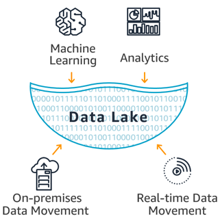

---
# This is the frontmatter which goes at the top of the MDX file
# Hashes in the frontmatter are comments
title: Data Sciences 
author: Srikanth Jallapuram
featuredImage: ./datascience.png
---

import styles from '../../blog/ai-chatbot/another.module.css'
import './datascience.css';

Innovation in Big Data Technologies is a strong forte of ours. At Technovature we design and implement innovative big data analytics solutions that allow companies to transform raw data into valuable and actionable insights and make informed business decisions. Certified by Amazon Web Services, Cloudera and Microsoft, our team works with a wide variety of technology stacks, including Apache Hadoop, Apache Spark, Apache Pulsar, Apache Kafka, Apache Storm, Apache Cassandra and other frameworks.

> 95 percent of businesses need to manage unstructured data.
> While People generate 2.5 quintillion bytes of data each day. 

 

# Data Services we Provide
 

 

<h3 style="text-align:center"> Big Data Advisory &amp; Consulting </h3>

 While Data Sciences and Artificial Intelligence is the higher level goal to achieve, however laying out a Data or a Big Data Strategy and the surrounding data infrastructure that include Data Engineering, Data Tools and Optimization of such complex engineering is essential before the full benefits of Artificial Intelligence is drawn by your Enterprise. Technovature is well versed with a Swiss-Army knife set of tools and platforms related to Data Engineering, Big Data Platforms, Data Analytics to create a robust Data Lake Architecture for your Enterprise to draw benefits out of it. 

 

<h3 style="text-align:center"> Big Data Engineereing </h3>

 Data engineering is the practice of making the appropriate data accessible and available to various data consumers (including data scientists, data analysts, business analytics and business users). It is a discipline that involves collaboration across business and IT. Technovature's Data engineering capabilities enable data users across the enterprise with clean, quality data they can trust, so they can drive better business insights and actions. Data engineering is the result of technology disruption in what we used to call big data while leveraging the cloud for agility.

 

<h3 style="text-align:center"> Data Lakes &amp; Data Warehousing </h3>

 Data lakes are used for cost-effective storage of large amounts of data from many sources. Allowing data of any structure reduces cost because data is more flexible and scalable as the data doesn’t need to fit a specific schema. However, structured data is easier to analyze because it’s cleaner and has a uniform schema to query from. By restricting data to a schema, data warehouses are very efficient for analyzing historical data for specific data decisions. Data analysts and business analysts often work within data warehouses containing explicitly pertinent data that has been processed for their work. 
 

 

<h3 style="text-align:center"> Data Analytics &amp; Visualization </h3>

 Enabling Data Visualization is all about the science and the art of displaying the data meaningfully while emphasizing on the clarity, coherence, and visual representation of the data. At Technovature, we understand the objectives of Data Visualization and we help our clients in Building Interactive Applications and Dashboard Designs. 

 

<h3 style="text-align:center"> Data Compliancec &amp; Data Security </h3>

 A lot of data that is used to gain insights can be attributed to individuals. Personally identifiable information is everywhere – sometimes even in unexpected places. Many consumers aren’t aware of how their data is being used and what organizations do with it. Concerns about the use of big data are leading to ever stricter regulations on how organizations can collect, store, and use information.

### What is Big Data Technology?
Big Data Technology can be defined as a Software-Utility that is designed to Analyse, Process and Extract the information from an extremely complex and large data sets which the Traditional Data Processing Software could never deal with.

> The toughest challenge for AI and advanced analytics is not AI, it’s actually data management at scale.

 

# Big Data Platforms &amp; Technologies we use

	

 

<h3 style="text-align:center"> Hadoop Platform</h3>

Hadoop Framework was designed to store and process data in a Distributed Data Processing Environment with commodity hardware with a simple programming model. It can Store and Analyse the data present in different machines with High Speeds and Low Costs.

 

<h3 style="text-align:center"> Apache Kafka</h3>

Apache Kafka is a Distributed Streaming platform. A streaming platform has Three Key Capabilities that are as follows: Publisher, Subscriber Consumer. This is similar to a Message Queue or an Enterprise Messaging System.

 

<h3 style="text-align:center"> Apache Pulsar</h3>

Pulsar is a multi-tenant, high-performance solution for server-to-server pub-sub messaging. Pulsar was originally developed by Yahoo, it is under the stewardship of the Apache Software Foundation.

 

<h3 style="text-align:center"> R Language</h3>

R is a Programming Language and free software environment for Statistical Computing and Graphics. The R language is widely used among Statisticians and Data Miners for developing Statistical Software and majorly in Data Analysis.

 

<h3 style="text-align:center"> RapidMiner</h3>

RapidMiner is a Centralized solution that features a very powerful and robust Graphical User Interface that enables users to Create, Deliver, and maintain Predictive Analytics. It allows creating very Advanced Workflows, Scripting support in several languages.

 

<h3 style="text-align:center"> Apache Spark </h3>

 Spark provides In-Memory Computing capabilities to deliver Speed, a Generalized Execution Model to support a wide variety of applications, and Java, Scala, and Python APIs for ease of development.

 

<h3 style="text-align:center"> Splunk </h3>

 Splunk captures, Indexes, and correlates Real-time data in a Searchable Repository from which it can generate Graphs, Reports, Alerts, Dashboards, and Data Visualizations. It is also used for Application Management, Security and Compliance, as well as Business and Web Analytics.

 

<h3 style="text-align:center"> Splunk Hunk </h3>

 Hunk lets you access data in remote Hadoop Clusters through virtual indexes and lets you use the Splunk Search Processing Language to analyse your data. With Hunk, you can Report and Visualize large amounts from your Hadoop and NoSQL data sources. 

 

<h3 style="text-align:center"> Elasticsearch </h3>

Elasticsearch is a Search Engine based on the Lucene Library. It provides a Distributed, MultiTenant-capable, Full-Text Search Engine with an HTTP Web Interface and Schema-free JSON documents.

#### Big Data - Big Picture
> Businesses that use big data saw a profit increase of ** 8–10 percent. **
> Businesses that use big data saw a **10 percent reduction** in overall cost.

### What is a Data Lake ?

> A data lake is a centralized repository that allows you to store all your structured and unstructured data at any scale. You can store your data as-is, without having to first structure the data, and run different types of analytics—from dashboards and visualizations to big data processing, real-time analytics, and machine learning to guide better decisions.

<figure>

 
<figcaption class="center"> <strong>Fig 1.1 </strong> Data Lake </figcaption>
</figure>

<figure>

 
<figcaption class="center"> <strong>Fig 1.1 </strong> Fastest Growing Categories of Big Data &amp; Business Analytics </figcaption>
</figure>
 
 

## So what are the Best Practices in Big Data ?

### Define the Big Data business goals 
#

Understanding the business requirements and goals should be the first and the most important step that you take before you even begin the process of leveraging Big Data analytics. The business users have to make clear their desired outcome and results, otherwise you have no target for which to aim.

This is where management has to take the lead and tech has to follow. If management does not make business goals clear, then you will not gather and create data correctly. Too many organizations collect everything they can and go through later to weed out what they don’t need. This creates a lot of unnecessary work if you just make abundantly clear up front what you do need and don’t collect anything else.
There is a set of problematic issues that pose a significant threat to cloud users, such as:

### Assess and strategize with partners 

A Big Data project should not be done in isolation by the IT department. It must involve the data owner, which would be a line of business or department, and possibly an outsider, either a vendor providing Big Data technology to the effort or a consultancy, to bring an outside set of eyes to the organization and evaluate your current situation.

Along the way and throughout the process there should be continuous checking to make sure you are collecting the data you need and it will give you the insights you want, just as a chef checks his or her work throughout the cooking process. Don’t just collect everything and then check after you are done, because if the data is wrong, that means going all the way back to the beginning and starting the process over when you didn’t need to.

### Determine what you have and what you need in Big Data

Lots of data does not equate good data. You might have the right data mixed in there somewhere but it will fall to you to determine it. The more haphazardly data is collected, the more often it is disorganized and in varying formats.

As important as determining what you have is determining what you don’t have. Once you have collected the data needed for a project, identify what might be missing. Make sure you have everything before you start.

It’s not always possible to know what data fields you need in advance, so make sure to engineer flexibility to go back and adjust as you progress.

### Keep continuous communication and assessment going 

Effective collaboration requires on-going communications between the stakeholders and IT. Goals can change mid-way through a project, and if that happens, the necessary changes must be communicated to IT. You might need to stop gathering one form of data and start gathering another. You don’t want that to continue any longer than it has to.

### Start slow, react fast in leveragingg Big Data

You first Big Data project should not be overly ambitious. Start with a proof of concept or pilot project that’s relatively small and easy to manage. There is a learning curve here and you don’t want to bite off more than you can chew.

Choose an area where you want to improve your business processes, but it won’t have too great of an impact in case things go wrong or badly. Also, do not force a Big Data solution approach if the problem does not need it.

You should also use Agile techniques and the iterative approach to implementation. Agile is a means of operation and it is not limited to development.

### Evaluate Big Data technology requirements 

The overwhelming majority of data is unstructured, as high as 90% according to IDC. But you still need to look at where data is coming from to determine the best data store. You have the option of SQL or NoSQL and a variety of variations of the two databases.

Do you need real-time insight or are you doing after-the-fact evaluations? You might need Apache Spark for real-time processing, or maybe you can get by with Hadoop, which is a batch process. There are also geographic databases, for data split over multiple locations, which may be a requirement for a company with multiple locations and data centers.

### Align with Big Data in the cloud

You have to be careful when using the cloud since use is metered, and Big Data means lots of data to be processed. However, the cloud has several advantages. The public cloud can be provisioned and scaled up instantly or at least very quickly. Services like Amazon EMR and Google BigQuery allow for rapid prototyping.

The first is using it to rapidly prototype your environment. Using a data subset and the many tools offered by cloud providers like Amazon and Microsoft, you can set up a development and test environment in hours and use it for the testing platform.

### Manage your Big Data experts, as you keep an eye on compliance and access issues

Big Data is a new, emerging field and not one that lends itself to being self-taught like Python or Java programming. A McKinsey Global Institute study estimates that there will be a shortage of 140,000 to 190,000 people with the necessary expertise this year, and a shortage of another 1.5 million managers and analysts with the skills to make decisions based on the results of analytics.

First thing that must be made clear is who should have access to the data, and how much access should different individuals have. Data privacy is a major issue these days, especially with Europe about to adopt the very burdensome General Data Protection Regulation (GDPR) that will place heavy restrictions on data use.

Reference: Datamation Big Data Best Practices

