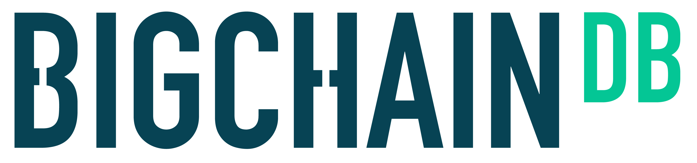

---
# This is the frontmatter which goes at the top of the MDX file
# Hashes in the frontmatter are comments
title: Blockchain Development 
author: Srikanth Jallapuram
featuredImage: ./blockchain.png
---

import Image from "gatsby-image";
import styles from '../../blog/ai-chatbot/another.module.css';
import ImageHolder from '../../../src/components/header-image.js';
import '../../../src/components/about/card.css';
import './blockchain.css';

Blockchain is amongst the cutting edge technology that has the potential to revolutionize aspects of our daily lives. Blockchain has had a great impact on the financial industry and is now moving towards impacting other industries as well. Blockchain technology, or simply Blockchain,  is the documentation system that supports cryptocurrency technology. It is essentially a decentralized and distributed record-keeping system that keeps track of all electronic bitcoin transactions.

## Why Blockchain Technology?

Its use is so widespread that, as of September 2018, there have been over 28 million blockchain wallet users worldwide. Since its conception, around 41 million people are using Blockchain wallets and have tracked over 200 billion USD worth in financial transactions. There is also an increasing number of countries exploring the possibility of adopting cryptocurrency, with over 140 countries reached by blockchain technology.

## Wide-range of Application

Due to its capacity to store transactional data, blockchain technology has been applied to various other industries and applications.

- The financial industry, banks, and cryptocurrency have benefited the most with the use of blockchains.
- Blockchains has now expanded towards storing and keeping track of medical records for healthcare providers.
- Property record management has also used blockchain to improve its monitoring and documentation of property record usage.
- Contractual transactions and agreements can also be verified negotiated using Smart Contract, which is a code that can be incorporated into blockchains.
- Supply chain use and management have also incorporated blockchains to improve tracking of food and material movement.  
- In 2018, blockchain was used during the midterm elections West Virginia to store votes and increase voter turnout. If adopted in a larger setting, it has the potential to eliminate election fraud and tampering, as well as boost efficiency and transparency.

# Our Blockchain Services

 
    According to IBM - Per year 265 Billion Customer Requests are recorded. Businesses spent nearly $1.3 trillion to service these requests. Using Chatbots can help them save up to 30% of this.

 

<h3 style="text-align:center"> Blockchain Consulting </h3>

We assess your existing solution, identify the need for a blockchain solution for your business case and analyze how blockchain will add value to your business. We suggest the ideal technology and the possible use cases of the proposed project.

 

<h3 style="text-align:center"> Blockchain Development </h3>

Once you understand the blockchain feasibility for your use case, you can move your project into the development. We develop and deliver scalable blockchain apps that will innovate your business operations.

 

<h3 style="text-align:center"> Blockchain Strategy </h3>

We provide you blockchain workshops to better understand blockchain technology and give you the basic knowledge about its potential applications and workings. We demonstrate how the blockchain can transform your industry with case studies of our projects. 

 

<h3 style="text-align:center"> Blockchain Wallet </h3>

The first conceptualization of the chatbot is attributed to Alan Turing, who asked “Can machines think?” in 1950. Since Turing, chatbot technology has improved with advances in natural language processing and machine learning.

# Blockchain Platforms we use

	

 

<h3 style="text-align:center"> Hyperledger Platform</h3>

The first apple conceptualization of the chatbot is attributed to Alan Turing, who asked “Can machines think?” in 1950. Since Turing, chatbot technology has improved with advances in natural language processing and machine learning.

 

<h3 style="text-align:center"> Ethereum Platform</h3>

The first apple conceptualization of the chatbot is attributed to Alan Turing, who asked “Can machines think?” in 1950. Since Turing, chatbot technology has improved with advances in natural language processing and machine learning.

 

<h3 style="text-align:center"> Kaleido Blockchain Business Platform</h3>

The first apple conceptualization of the chatbot is attributed to Alan Turing, who asked “Can machines think?” in 1950. Since Turing, chatbot technology has improved with advances in natural language processing and machine learning.

 

<h3 style="text-align:center"> R3 Corda Platform </h3>

The first apple conceptualization of the chatbot is attributed to Alan Turing, who asked “Can machines think?” in 1950. Since Turing, chatbot technology has improved with advances in natural language processing and machine learning.

 

<h3 style="text-align:center"> BigChainDB Platform</h3>

The first apple conceptualization of the chatbot is attributed to Alan Turing, who asked “Can machines think?” in 1950. Since Turing, chatbot technology has improved with advances in natural language processing and machine learning.

 

<h3 style="text-align:center"> IOTA Blockchain Open Platform</h3>

The first apple conceptualization of the chatbot is attributed to Alan Turing, who asked “Can machines think?” in 1950. Since Turing, chatbot technology has improved with advances in natural language processing and machine learning.

### What is a Blockchain?

> *The most natural definition of a blockchain is – an immutable time-stamped series record of data that is distributed and managed by cluster of computers*

A chatbot is programmed to work independently from a human operator. It can answer questions formulated to it in natural language and respond like a real person. It provides responses based on a combination of predefined scripts and machine learning applications.

However, many challenges still remain for consumer users using the chatbots as below.

### Blockchain For Enterprise: Principles, Steps, And Best Practices
Six principles for blockchain development and implementation
- **Open**: The blockchain solution should be open. This means that it should be open source allowing anyone to contribute to its growth. The open-source tag will also bring innovation and ensure that quality code is maintained.
- **Permissioned**: Permissioning is also a critical principle that an enterprise blockchain needs to follow. Permissioned networks are designed to work in a closed ecosystem by keeping key features of blockchain intact. It promotes confidentiality and trust and ensures that illegal activities can be controlled. Permissioned networks also ensure that only trusted entities can interact with the network — making it more secure and viable in the long run.
- **Governance**: Enterprise blockchain should have proper governance system. It enables administrators to run and maintain the network. Strong governance ensures that no one can abuse the network for their advantage. Admins can take necessary steps to stop malicious actors before they start to attack the network or stop them during the attack.
- **Security**: Security needs to be top-notch for any blockchain development. Blockchains are secure, but they still require proper security planning and execution. Also, it is an on-going process, and the security team should do a periodic check to ensure platform integrity.
- **Standards**: Standards are also a key part of any blockchain solution. WIth interoperable standards, it is easy for teams to work across different requirements, needs, or integrations. Right now, there are only independent entities that are working on their own blockchain solution — which is not a good idea for the long run.
- **Privacy**: The privacy aspect is also very important. Without the right to privacy, a blockchain solution cannot do justice to its other features such as transparency or immutability. That’s why an enterprise blockchain solution should work towards a solution that offers privacy from the onset.

## So what are the Best Practices in building a Blockchain?

<ImageHolder /> 

<h4><b>John Doe</b></h4> 

Architect and Engineer
 

<ImageHolder /> 

<h4><b>John Doe</b></h4> 

Architect & Engineer
 

<ImageHolder /> 

<h4><b>John Doe</b></h4> 

Architect & Engineer
 
<a href="http://www.yahoo.com" target="_blank" 
style={{
	color: 'black',
	backgroundColor: 'blue',
	textDecoration: 'none',
	zIndex: 99
}}>
	<b>
Learn More
</b>
</a> 

### Build a service that never sleeps

Chatbots offer a number of comparative advantages. They offer 24/7 availability, where a fully dedicated resource is providing you the desired service with unmatched control and transparency. They offer instant customer service and enhance brand value. Above all, since they are intelligent, bots can be scaled up quickly allowing you to focus on important tasks instead of being part of every conversation.

### Empower the convenient intelligence

Using the deep learning powers, you can train chatbots to behave more like a human and deliver interactions in different languages of your choice. You can improve  customer retention rate by providing a highly customized and personalized experience to each user. Their ability to deliver a cognitive digital experience and manage multiple interactions with natural interface makes them a very cost-effective option for customer support, e-commerce sales, information retrieval, help-desk and many more such cases.

Some other key benefits to be drawn from building and deploying bots in our organization are as below:

- **They cut down Operational Costs** 💰
  Per year there are a reported 265 Billion Customer Requests. Businesses spent nearly $1.3 trillion to service these requests. Using Chatbots can help you save up to 30% of this.
- **Chatbots empowers your Team** 💪
  Chatbots will not entirely replace humans. Rather they will become the first-level support that filters a customer request and save you time.
- **They boost your Brand Outlook** 🙌
  The visual interaction offers a friendly experience and ensures a healthy rapport with your customer base spread across the world.
- **It's easier than making an App** 💁‍♀️
  In the productivity category, chatbots outperform apps in all aspects of functionality and is more cost-effective.
- **Millennials love Chatbots** 👫
  The speed of communication and ease of use has given a sweet spot for chatbots in the Millennial audience compared to legacy tools.

### Conversational User Experience

Conversational User Experience (CUX) will be adopted by most businesses in 2019. It is a newer version of UX design, and have features like guided conversations, brand persona development, and personalized content. Its main purpose is to help businesses to create rapid and helpful customer interactions on their chatbot. CUX is something to keep in mind, as any business that fails to keep up with CUX may risk their customer support.

(NLP) Natural Language Processing Chatbots finds a way to convert the user's speech or text into structured data.  

The goal of natural language processing (NLP) is to take the unstructured output of the ASR and produce a structured representation of the text that contains spoken language understanding(SLU) or, in the case of text input, natural language understanding (NLU).

Which is then utilized to choose a relevant answer. Natural Language Processing includes the following steps;

1. **Tokenization:** The NLP separates a series of words into tokens or pieces that are linguistically representative, with a different value in the application.
2. **Sentiment Analysis:** It will study and learn the user's experience, and transfer the inquiry to a human when necessary
3. **Normalization:** This program model processes the text to find out the typographical errors and common spelling mistakes that might alter the intended meaning of the user request.
4. **Named Entity Recognition:** The program model of chatbot looks for different categories of words, similar to the name of the particular product, the user's address or name, whichever information is required.
5. **Dependency Parsing:** The Chatbot searches for the subjects, verbs, objects, common phrases and nouns in the user's text to discover related phrases that what users want to convey.

## **Bot Evaluation**

**Evaluation Perspectives**

There are a number of different perspectives on how to evaluate chatbot performance. From an information retrieval (IR) perspective, chatbots have specific functions: there are virtual assistants, question-answer and domain-specific bots.

Evaluators should ask questions and make requests of the chatbot, evaluating effectiveness by measuring accuracy, precision, recall, and F-score relative to the correct chatbot response.

 From a user experience perspective, the goal of the bot is, arguably, to maximize user satisfaction. Evaluators should survey users (typically, measured through questionnaires on platforms such as Amazon Mechanical Turk), who will rank bots based on usability and satisfaction. 

From a linguistic perspective, bots should approximate speech, and be evaluated by linguistic experts on their ability to generate full, grammatical, and meaningful sentences. 

Finally, from an artificial intelligence (AI) perspective, the bot that appears most convincingly human (e.g. passes the Turing Test best) is the most effective. 

References:

1. Chatbot: Architecture, Design & Development by Jack Cahn

