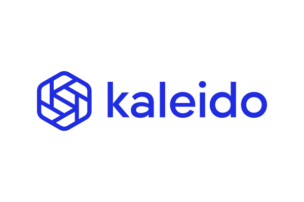

---
# This is the frontmatter which goes at the top of the MDX file
# Hashes in the frontmatter are comments
title: Blockchain Development 
author: Srikanth Jallapuram
featuredImage: ./blockchain.png
---

import Image from "gatsby-image";
import styles from '../../blog/ai-chatbot/another.module.css';
import ImageHolder from '../../../src/components/header-image.js';
import '../../../src/components/about/card.css';
import './blockchain.css';

Blockchain is a distributed ledger technology (DLT) that allows data to be stored globally on thousands of servers – while letting anyone on the network see everyone else's entries in near real-time. That makes it difficult for one user to gain control of, or game, the network.

Blockchain has had a great impact on the financial industry and is now moving towards impacting other industries as well. 

## Why Blockchain Technology?

Its use is so widespread that, as of September 2018, there have been over 28 million blockchain wallet users worldwide. Since its conception, around 41 million people are using Blockchain wallets and have tracked over 200 billion USD worth in financial transactions. There is also an increasing number of countries exploring the possibility of adopting cryptocurrency, with over 140 countries reached by blockchain technology.

## Wide-range of Application

Due to its capacity to store transactional data, blockchain technology has been applied to various other industries and applications.

- The financial industry, banks, and cryptocurrency have benefited the most with the use of blockchains.
- Blockchains has now expanded towards storing and keeping track of medical records for healthcare providers.
- Property record management has also used blockchain to improve its monitoring and documentation of property record usage.
- Contractual transactions and agreements can also be verified negotiated using Smart Contract, which is a code that can be incorporated into blockchains.
- Supply chain use and management have also incorporated blockchains to improve tracking of food and material movement.  
- In 2018, blockchain was used during the midterm elections West Virginia to store votes and increase voter turnout. If adopted in a larger setting, it has the potential to eliminate election fraud and tampering, as well as boost efficiency and transparency.

# Our Blockchain Services

 
About 90% of U.S. and European banks had started exploring blockchain’s potential by 2018.

 

<h3 style="text-align:center"> Blockchain Consulting </h3>

We assess your existing solution, identify the need for a blockchain solution for your business case and analyze how blockchain will add value to your business. We suggest the ideal technology and the possible use cases of the proposed project.

 

<h3 style="text-align:center"> Blockchain Strategy </h3>

We provide you blockchain workshops to better understand blockchain technology and give you the basic knowledge about its potential applications and workings. We demonstrate how the blockchain can transform your industry with case studies of our projects. 

 

<h3 style="text-align:center"> Smart Contract Development </h3>

 
We develop Smart Contracts that are now essential to any blockchain-based business. The self-executing digital contract is the key to automate processes, transactions and agreements, helping to reduce costs, hence security and end for good the very confusing and not reliable paperwork.Smart contracts are automated digital contracts that enable highly-secure and self-executing agreements to be formulated and save huge costs. 

 

<h3 style="text-align:center"> Blockchain Development </h3>

Once you understand the blockchain feasibility for your use case, you can move your project into the development. We develop and deliver scalable blockchain apps that will innovate your business operations.

 

<h3 style="text-align:center"> Blockchain Wallet </h3>

 We provide cryptocurrency and blockchain wallet development services as per the specific requirements of the enterprise or the business with adequate market research. Our team of skilled crypto and blockchain developers ensures the timely realization of the crypto and blockchain development projects.

# Blockchain Platforms we use

	

 

<h3 style="text-align:center"> Hyperledger Platform</h3>

Hyperledger is an enterprise-grade, open-source distributed ledger framework launched by the Linux Foundation in December 2015. Fabric is a highly-modular, decentralized ledger technology (DLT) platform that was designed by IBM for industrial enterprise use

 

<h3 style="text-align:center"> Ethereum Platform</h3>

Ethereum is an open source, public, blockchain-based distributed computing platform and operating system featuring smart contract (scripting) functionality. ... Ethereum was proposed in late 2013 by Vitalik Buterin, a cryptocurrency researcher and programmer.

 

<h3 style="text-align:center"> Kaleido Blockchain Business Platform</h3>

The Kaleido Blockchain Business Cloud is the only full-stack platform for building and running cross-cloud, hybrid enterprise ecosystems and the industry-leading Blockchain-As-a-Service Provider.

 

<h3 style="text-align:center"> R3 Corda Platform </h3>

Corda is an open source blockchain platform that enables businesses to transact directly and in strict privacy using smart contracts, reducing transaction and record-keeping costs and streamlining business operations. In a world of permission-less blockchain platforms, in which all data is shared with all parties, Corda’s strict privacy model allows businesses to transact securely and seamlessly.

 

<h3 style="text-align:center"> BigChainDB Platform</h3>

 BigchainDB is a blockchain database offering decentralization, immutability and native assets. BigchainDB allows for the deployment of large-scale applications in a variety of use cases and industries from intellectual property and identity to supply chain, IoT and artificial intelligence.

 

<h3 style="text-align:center"> IOTA Blockchain Open Platform</h3>

The first open-source distributed ledger that is being built to power the future of the Internet of Things with feeless microtransactions and data integrity for machines.

### What is a Blockchain?

> *The most natural definition of a blockchain is – an immutable time-stamped series record of data that is distributed and managed by cluster of computers*

> With the advent of distributed ledger technologies, we are now able to distribute and synchronize ledgers of data and money in secure, distributed, decentralized and permissionless environments. By removing the need for trusted third-parties as the gatekeepers and arbiters of truth, enormous efficiency gains, innovation opportunities and new value propositions emerge.

 

## What challenges remain for implementing Blockchain?
Blockchain technology promised a compelling vision: **decentralized networks allowing open innovation** and **peer-to-peer transactions without intermediaries or fees**. Ultimately, they were never built to execute it in full, due to inherent technical flaws in their design. As blockchain adoption has increased over the last decade, early adopters have been hit with sluggish transaction times and skyrocketing fees. As **financial rewards** for validating blockchain transactions became increasingly competitive, their networks have also become increasingly centralised around a few powerful actors. But the need for ** decentralized and permissionless systems** remains, and has only increased in recent years.

However, many challenges still remain for consumer users using the blockchain as below.

### Blockchain For Enterprise: Principles, Steps, And Best Practices
Six principles for blockchain development and implementation
- **Open**: The blockchain solution should be open. This means that it should be open source allowing anyone to contribute to its growth. The open-source tag will also bring innovation and ensure that quality code is maintained.
- **Permissioned**: Permissioning is also a critical principle that an enterprise blockchain needs to follow. Permissioned networks are designed to work in a closed ecosystem by keeping key features of blockchain intact. It promotes confidentiality and trust and ensures that illegal activities can be controlled. Permissioned networks also ensure that only trusted entities can interact with the network — making it more secure and viable in the long run.
- **Governance**: Enterprise blockchain should have proper governance system. It enables administrators to run and maintain the network. Strong governance ensures that no one can abuse the network for their advantage. Admins can take necessary steps to stop malicious actors before they start to attack the network or stop them during the attack.
- **Security**: Security needs to be top-notch for any blockchain development. Blockchains are secure, but they still require proper security planning and execution. Also, it is an on-going process, and the security team should do a periodic check to ensure platform integrity.
- **Standards**: Standards are also a key part of any blockchain solution. WIth interoperable standards, it is easy for teams to work across different requirements, needs, or integrations. Right now, there are only independent entities that are working on their own blockchain solution — which is not a good idea for the long run.
- **Privacy**: The privacy aspect is also very important. Without the right to privacy, a blockchain solution cannot do justice to its other features such as transparency or immutability. That’s why an enterprise blockchain solution should work towards a solution that offers privacy from the onset.

## What are the best practices in building a Blockchain Solution?

The greatest promises of blockchain technology is Its strength as a platform to build new generations of transactional applications that will allow users to establish trust and maintain high security for their data and processes. 

### Secure today does not mean secure tomorrow

When people hear about blockchain, one of the things they learn about is that it is secure and cryptographically protected. With that information, they then often think they shouldn’t have concerns about using blockchain along with personally identifiable information (PII). The problem is that such an assumption fails to consider the future because as soon as hackers and other bad actors eventually break the cryptographic algorithms that protect such blockchain data today, then all that data will become a treasure trove for criminals. Regardless, developing technologies such as quantum computing could one day make successful attacks on the security of cryptographic keys possible.

### Never store large files on a blockchain

Blockchains work by using large numbers of computers that are basically replicating data. So, when data is stored on the blockchain, it gets sent to every other node or peer on the blockchain network. When that happens, storage and compute costs can go up exponentially. To avoid those kinds of added costs, other means of storing and replicating that data should be used, including options such as the Amazon’s Simple Storage System (AWS S3), Google Cloud Platform’s Filestore or other cloud networks. That way, when users are storing big files, they are not paying extra to store, transfer and replicate multiple copies of the same data.

### If you don’t want your data to be public, use a permissioned blockchain

Not all blockchains are public, where anybody has access to the information and can add transactions and read the data that’s in it. When enterprises want to keep things private, that’s where permissioned blockchains come in – data can be stored, accessed and used only between the partners who need to have access. That’s the main reason such permissioned blockchains exist. While things like Bitcoin and Ethereum are public blockchains, the Hyperledger projects are mostly permissioned blockchains. And that’s exactly why they are suitable for business. If your data must remain private, then use a permissioned blockchain. Some people call them private blockchains or consortium blockchains, but those normally fall into the permissioned blockchain space.

### Create a governance structure for the blockchain

With blockchains, the challenges aren’t technical. Instead, the challenges involve the governance model that is chosen. To keep things working smoothly, it’s best to define the governance structure upfront and even before you dive into blockchain. For example, be sure to decide things like how new users or organizations will be added to a blockchain network, as well as how to determine if a user or organization should be cut out of the network. To protect the blockchain, the data and the rest, be sure to include a mechanism to deal with and remove bad actors who were previously allowed into the network. The governance structure can also address procedures for many other possible situations, as well as how to cope with the politics of the user group. Just remember, these things are still evolving, so those governance procedures will likely change over time.

### Decide on performance and scalability requirements

Different tasks may require different blockchains. As a best practice, architects must understand the requirements for their specific use cases and ensure that their blockchains meet those requirements, just like they would evaluate for any other technology. Certain technologies fit better with specific requirements, so architects must decide on their trade-offs. Are they okay giving up scalability for performance or are they okay giving up the performance to get needed scalability? Those are the kinds of decisions that need to be made early on with each deployment and use case. With the different Hyperledger frameworks, enterprises can set up their own blockchain networks as needed.

### Analyze blockchain business cases early

To ensure success for the project, IT leaders should ask themselves lots of detailed questions early in the process about their goals for a blockchain initiative.

You need to analyze the business case and go through a checklist. Do multiple people need access to the data? Do you need an audit trail? Do you actually even need a blockchain? Does it make sense for us? For some projects, the use of a database can be the right choice. 

Enterprises should approach the project by designing and building a strategy that will help the project reach its goals, and not just aimlessly look to create a blockchain just to dive into the latest technology, he says. At the same time, enterprise IT leaders shouldn’t try to plan ahead for every feature and capability for their blockchains because some will become more apparent later and can be added as the project proceeds.

Blockchain can be a great choice for projects that rely on security, controlled access, accountability, transparency and efficiency in a wide range of fields, from finance to banking, supply chains, manufacturing and more. Having well laid plans, goals and best practices can all help enterprise IT leaders explore the growing blockchain ecosystem as they work to capture its strengths for their businesses.

Reference: 'Six Blockchain Best Practices for Enterprises" by Hyperledger
