---
# This is the frontmatter which goes at the top of the MDX file
# Hashes in the frontmatter are comments
title: Fintech Development 
author: Srikanth Jallapuram
featuredImage: ./images/fintech3.jpg
---

import styles from '../../blog/ai-chatbot/another.module.css'
import './fintech.css';

Technovature plays a key role in Fintech Application development in a field that has disrupted the traditional financial services industry and increased opportunity for fresh market entrants and technology-focused startups in the industry. While exciting, the Fintech revolution cautions and thoroughly monitors the regulatory and practical hazards connected with new innovative techniques and platforms.

> Fintech may disrupt US$4.7 Trillion of Global Financial Services Revenue.

# How To Fintech 
 

 

<h3 style="text-align:center"> Customer Centricity </h3>

 
FinTech is not about money. FinTech is about people. Putting your customer satisfaction above the PowerPoint graphs is something industry moguls can’t afford – and what gives new innovators a great competitive advantage

 

<h3 style="text-align:center">  Product Design </h3>

Responding to customer insights is best expressed in how you design your product. Every element of the interface, every interaction part of the user experience can be a dealbreaker. FinTech businesses are fighting for one thing that top banking players have been losing since 2008 – which is trust.

 

<h3 style="text-align:center"> Short Time-to-Market </h3>

 
FinTech is growing rapidly and your time-to-market needs to keep up with the speed of the industry. Learning to define the core elements of the product and developing efficient MVPs is key to put your idea out there and receive the most valuable response you can get – directly from the users.

 
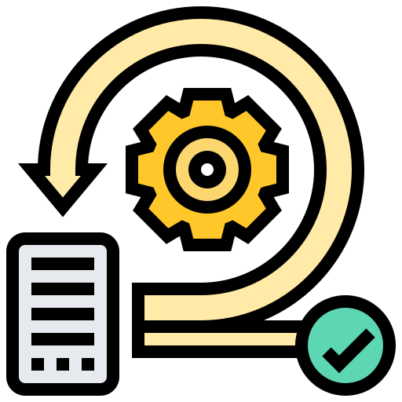
<h3 style="text-align:center"> Agile Product Development </h3>

In the fast-paced FinTech world, the software development process needs to give you the ability to adapt and respond to changing conditions. Agile product development is a proven way to maintain high quality code and design while making the most of the given time and talent.

 

<h3 style="text-align:center"> Blockchain Cryptocurrency Development </h3>

The blockchain sector in fintech has been intended to provide banking with a more seamless and effective experience, from cost reductions (anticipated savings of around $15-20 million by 2022) to uncheck unconditional bureaucracies in the traditional banking sector. This augurs well for both the bank and the clients.

 
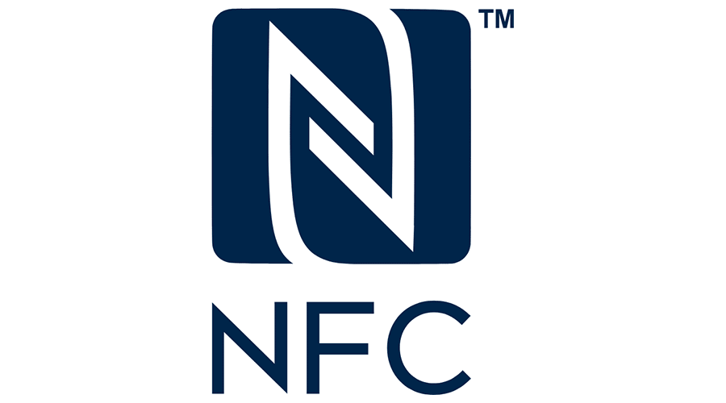
<h3 style="text-align:center"> Contactless and NFC payments </h3>

With NFC any device can be a payment device while you can simply tap your nfc card, any hand-phone (with sticker on back), your smart watch/phone or any item with small sticker on it. It introduces a better way to add secure payment capabilities based on NFC to add to any object like car keys, or things you wear, like wristbands, jewelry, and other fashion accessories etc.

 

<h3 style="text-align:center"> Internet of Things </h3>

Internet of Things (IoT) devices such as smart watches, wearables, Bluetooth Low Energy (BLE) beacons all present very interesting and innovative opportunities for enabling various payment capabilities inter-mixed with IoT devices with IoT devices serving as a point of inflection in an Innovative Fintech App or Service.

 

<h3 style="text-align:center">  Scalable Teams </h3>

It may turn out that your team needs new talent on different levels of product development. The clock is ticking, the product is not moving as fast as possible – that’s when team offshoring and nearshoring comes in handy. You can easily change the shape and skill set of your team according to current product needs.

 
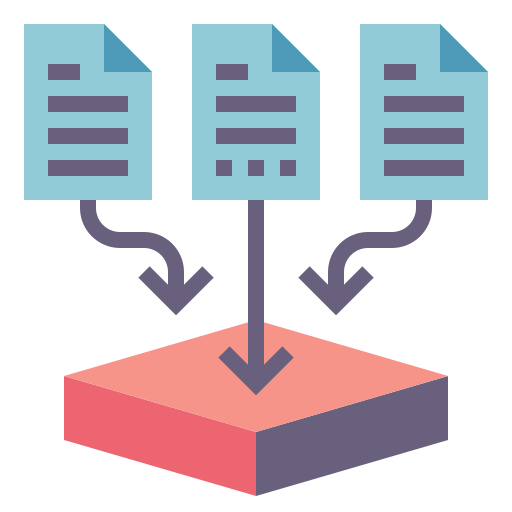
<h3 style="text-align:center">  FinTech Ready Technology Stack </h3>

Product design is just the beginning – the next step is to choose the optimal technology stack. No matter if it’s web or mobile, frontend or backend, every application needs a cautious selection of programming tools that will maintain optimal performance for a long time.

> A Sound Innovation in acquiring and integrating the right set of Fintech APIs can enable the **Banking as a Service (BaaS)** and **Banking as a Product (BaaP)**. 

 

# FinTech APIs and Technologies We Use 

API technology has become an integral part of Fintech, together offering future-proof solutions for the entire finance industry. API-Driven Innovation Helps Fintech in Offering a Cost-Effective Model while bringing openness to Fintech. 

> FinTech APIs and Fintech Innovation is the right mix to transform existing legacy based Banking into a **Platform Business** offering immense value and a solid user experience for the **New Age consumer**.

	

 
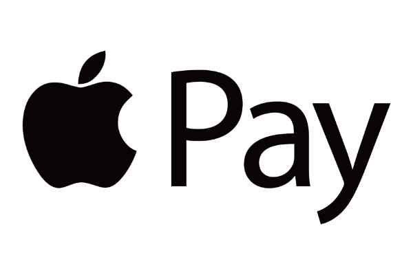
<h3 style="text-align:center"> Apple Pay </h3>

Apple Pay is easy and works with the Apple devices you use every day. You can make secure purchases in stores, in apps, and on the web. And you can send and receive money from friends and family right in Messages. Apple Pay is even simpler than using your physical card, and safer too.

 
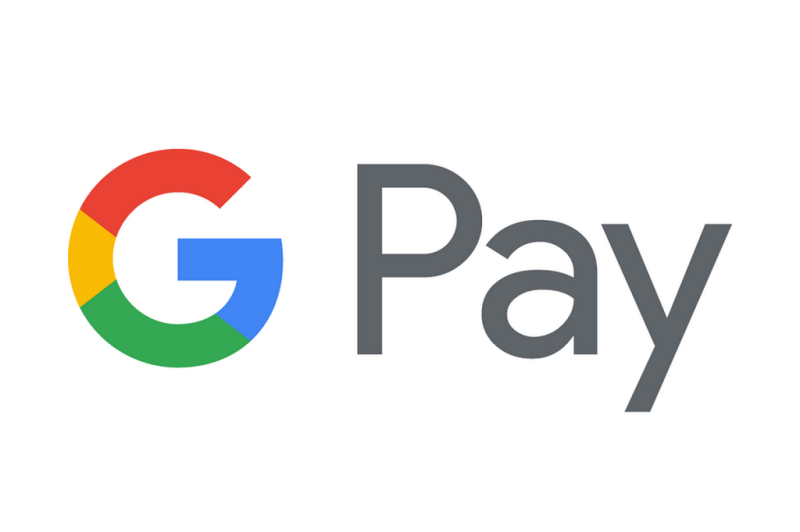
<h3 style="text-align:center"> Google Pay </h3>

Google Pay is a digital wallet platform and online payment system developed by Google to power in-app and tap-to-pay purchases on mobile devices, enabling users to make payments with Android phones, tablets or watches.

 

<h3 style="text-align:center"> Visa API</h3>

Visa Developer is transforming the way we connect to partners by making many of our network and technologies available through APIs . From geolocation to real-time alerts to tokenisation, the Visa Developer Platform offers you direct access to a growing number of APIs, tools and support that could help you build easier, faster and more secure ways to power commerce.

 
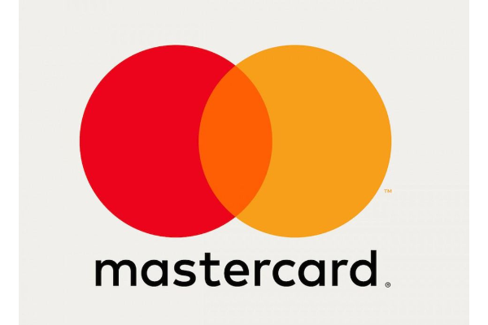
<h3 style="text-align:center"> MasterCard API</h3>

Mastercard Innovation Engine, is an API-based digital platform that enables issuers and merchants to provide digital capabilities to customers. The plug-and-play platform brings together Mastercard assets and FinTech services to provide enhanced customer experiences.

 

<h3 style="text-align:center"> CardConnect API </h3>

CardConnect provides a library of application programming interfaces (APIs) that allow you to integrate various services within your application. Each CardConnect API uses a standard set of protocols to allow your application to interact with these services.

 
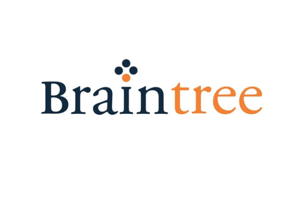
<h3 style="text-align:center"> Braintree API </h3>

 Using Braintree API, you can accept and process cards, wallets, and local payment methods in a single, modern integration. Store customer and payment information to reduce friction at checkout.

 

<h3 style="text-align:center"> PayPal API </h3>

 PayPal offers REST APIs for new integrations. These APIs use HTTP methods, a RESTful endpoint structure, the OAuth 2.0 protocol, and JSON-formatted payloads. Use REST APIs to incorporate PayPal functionality into your web and mobile apps.

 
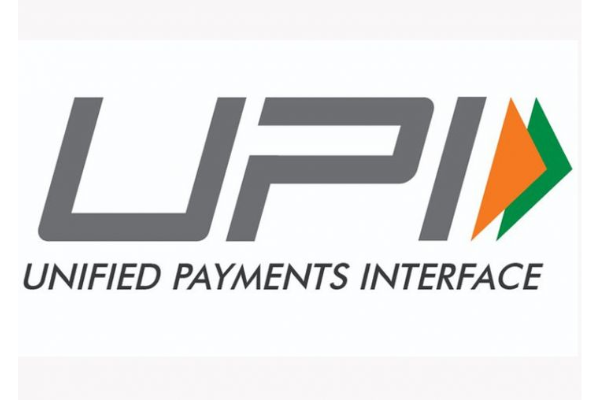
<h3 style="text-align:center"> India's BHIM UPI </h3>

 Unified Payment Interface” (UPI) is a great example of spectactular adoption as a P2P payment method and it enables all bank account holders in India to send and receive money instantly from their smartphones without the need to enter bank account information or net banking userid/ password. It supports SDK for both Android and iOS mobile platforms to develop UPI enabled fintech/payment apps.

 
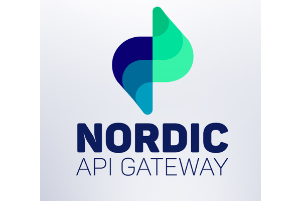
<h3 style="text-align:center"> Nordic API </h3>

 Nordic API Gateway is an open banking platform that enables frictionless financial futures for all. With its API it empowers banks, accounting systems, lenders and other businesses to innovate on top of financial data and initiate fast and seamless account-to-account payments. Nordic API Gateway has the most extensive coverage of banks in the Nordics, including all business and personal accounts. 

 
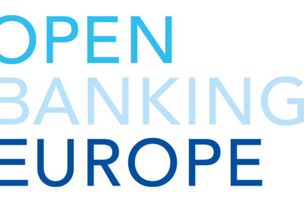
<h3 style="text-align:center"> Open Banking API </h3>

Open banking is a concept in financial services based on several principles: the use of open APIs allowing third party developers to build applications and services around financial institutions, increased financial transparency options for account holders and the use of open source technology to achieve these principles.

 

<h3 style="text-align:center"> Data Catalog API</h3>

The World Bank's Open Data initiative provides all users with open access to World Bank data. The Data types range from Time Series dataset to Microdata collected from sample surveys and censuses and finally Geospatial data that has explicit geographic positioning information.

 

<h3 style="text-align:center"> Stripe API </h3>

The Stripe API is a payments API that is organized around REST. Our API has predictable resource-oriented URLs, accepts form-encoded request bodies, returns JSON-encoded responses, and uses standard HTTP response codes, authentication, and verbs.

 
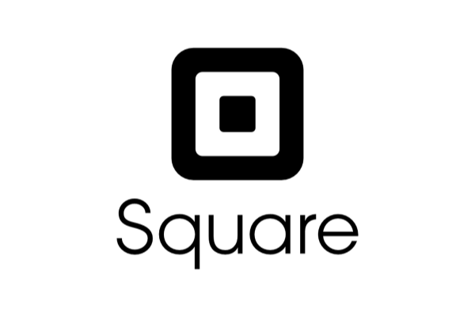
<h3 style="text-align:center"> Square API </h3>

Square provides collections of APIs that work together to solve a variety of problems, including online payments (eCommerce), in-person payments (point of sale), product management, customer management, and business management.

 

<h3 style="text-align:center"> Passkit Wallet API </h3>

PassKit is a pass and ticket generator for Apple's PassBook. PassKit offers templates and designs for event tickets, coupons, giftcards, and boarding passes. The PassKit API allows developers to access and integrate the functionality of PassKit with PassBook and other applications.

### Fintech Statistics

<figure>
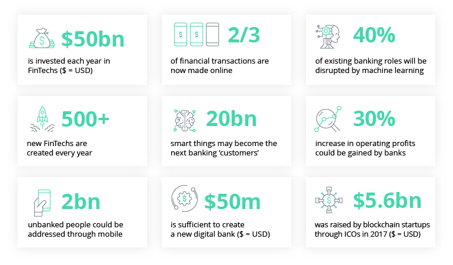
 
<figcaption class="center"> <strong>Fig 1.1 </strong> Important Fintech Statistics in 2020</figcaption>
</figure>
 
 

## So what are the Best Practices in FinTech Development ?

The emergence of new and disruptive financial technology is fueling the need for innovation by traditional financial institutions as they attempt to keep pace with demands for better technology-based services. Consumers are demanding more actionable and intuitive user experiences from bank technologies. As a result, the financial services industry is more focused on technology innovation than at any other point in its history.

Data aggregation—the ability to compile and create meaningful data from disparate sources—remains critical to providing innovative digital experiences to consumers. Indeed, modern financial data aggregation goes far beyond its initial beginnings of scraping financial data from screens and even from the structured data feeds that top aggregators use to gather consumer financial data for financial services organizations.

Data aggregation services today require a more comprehensive scope to cover leading practices in the following areas:
- Access to the Best Financial Data Available on a Massive Scale
- Financial Data that is Made to Do More – Data + Intelligence™
- Bank-Level Data Security

### Data Aggregation and Intelligence
#

In recent years, account data aggregation has evolved in response to major industry trends that include: the move to cloud technologies, the emergence of Big Data, user experiences that demand rich real-time data, and the flexibility of open platform models. With the growth in consumer demand for financial guidance from their financial institutions, advisors, and consumer apps, data aggregation has taken on greater importance as a strategic asset.

### Data Aggregation Considerations 

Financial data aggregation is the automatic collection of
personal financial account data from multiple sources,
within and outside the financial institutions, into a single
resource. Data is compiled from different accounts that
often include bank, credit card, and investment accounts,
as well as other consumer or business accounts.

### Data Intelligence Opportunities

Big Data, however, generally refers to a set of technologies that manage massive data sets—like the data that comes from financial aggregation. The most interesting trends in the area now involve how organizations can use the wealth of data that is available to drive decisions, support product development, and identify customer needs.

These goals go beyond data reporting and enter the realm of data intelligence, a data science discipline in its own right. “Data intelligence has a slightly different philosophy (than big data) that embraces some of the messy and unstructured nature of the world that we do live in,” says Sean Gourley, Co-Founder and CTO, Quid, a data intelligence firm.2

Data intelligence helps improve processes and results, according to a survey by the Association of Financial Professionals.3 According to more than half of all respondents and some 80 percent of respondents
at organizations with successful data intelligence programs in place, data intelligence provides the following benefits:
- Accuracy of analysis
- Ability to identify relevant and available data sources
- Ability to reach actionable conclusions from analysis

Data intelligence leverages data science to give big data its power. The real worth of data aggregation lies in the ability to tap the insights that lie in the underlying data. Assuming high-quality data, data intelligence provides an analytics layer on top of the aggregation platform that enables pattern and insight recognition and can help:
- Anticipate consumer financial needs
- Provide customers with ability to create a uniquely personalized user experience
- Predict future activity along with simple, actionable guidance

### Security Risk Assessments 

Protecting personal information of individuals who use our customers’ products and services must be a top priority for any data aggregation service. The heightened awareness of security breaches in the financial system only heightens the need for a complete and thorough review of the security standards followed by any third party that handles financial data.

### The Innovative Imperative

Innovation is not generally considered a strength of financial institutions. For traditional financial institutions to build on their competitive advantage and regain the profits they have enjoyed in the past, however, innovation must become a best practice in financial services.
It’s no surprise that large, traditional banking and other financial services firms have largely avoided serious innovation for decades. From disparate data silos to archaic back-end software platforms, the financial services industry is working with systems that, in some cases, have been functioning for decades. Any major change is risky to existing customer operations.

Today, there are hundreds of new FinTech entrants, born in the digital age, that have accelerated the delivery of smarter and more personalized financial solutions that are often faster, and easier to use. Building anew is much easier than renovating outdated service platforms. As a result, disruptive FinTech innovation tends to occur in newer and more nimble financial service firms.

Reference: " Best Practices for Driving the FinTech
Digital Transformation " by ENVESTNET Yodlee
