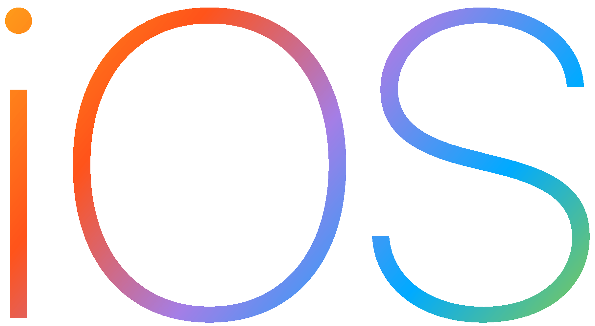

---
# This is the frontmatter which goes at the top of the MDX file
# Hashes in the frontmatter are comments
title: Mobile Technologies 
author: Srikanth Jallapuram
featuredImage: ./images/mobile.png
---

import styles from '../../blog/ai-chatbot/another.module.css';
import './mobile.css';

> Mobile is the enabling centerpiece of digital convergence. Mobile is the glue for all other digital industries to use when approaching convergence, but mobile is also the digital gateway for the real world to join in this global metamorphosis of human behavior.
 
 &mdash;  Tomi Ahonen 

<h1 style={{
	    flex:'40%',
	    marginLeft: '3%',
	    textAlign:'left',
	    fontSize:'32px'
	}}>
Enterprise Grade Mobile User Experience Development
</h1>

Building Digital Experiences is in our DNA. With Mobile having led the revolution into all things Digital, Technovature has been part of that journey from the beginning. In researching and identifying enterprise mobility use cases and designing, developing and delivering world-class digital enterprise mobility solutions. However we do understand now that digital footprint has even more spread its wings with mobile devices having become ten times more powerful and feature rich and with users interacting diigitally not only via mobile but via smart watches, wearables, smart interfaces, internet of things (IoT) devices etc. Our teams do understand that building Mobile Solutions in the upcoming decade is being leaning but delivering powerful but intelligent experiences and service at the right moment to the right user. 

	
<h1 style={{
	    textAlign:'left', fontSize:'32px'
	}}>
Complex Software and Systems Architecture Thinking 
</h1>

With a deep expertise in Systems Thinking and Architecture, our seasoned architects help our clients evaluate options to bring their projects to life. The best mobile experiences require a robust back-end foundation and an excellent understanding of the latest mobile platforms. Our teams have years of experience integrating with back-end and middleware systems, microservices, APIs and can evaluate alternatives based on cost, time to market, implementation risk, performance, scaling, and security considerations.

<figure>
	
	 
    	<figcaption class="center"> Figure-1.1: Apple Family of Devices </figcaption>
</figure>
 
 

> Apple sold more watches (8 million) than the entire Swiss watch industry in Q4 2017. A trillion photos are taken each year on iOS devices.

	
<h1 style={{
	    textAlign:'left', fontSize:'32px'
	}}>
Apple Technologies &amp; Application Development 
</h1>

We began building iOS apps from the earlier versions of iOS  and have seen the evolution of the iPhone SDK becoming more mature and more feature rich and powerful . We leverage the strengths of each and every iOS platform to build incredible solutions across iPhone, iPad, Apple Watch, and Apple TV. The result: over 20 of our clients’ apps have been featured in the App Store, and Technovature has been named an official member of Apple’s Mobility Partner Program (MPP).

 

<h3 class="h3-img"> iPad App Development </h3>

iPadOS features additional technologies that take advantage of the unique functionality of iPad using the iOS SDK. With iPadOS, your iPad apps can now deliver multiwindow experiences, add full drawing experiences for Apple Pencil, and contribute fonts for systemwide use.

 

<h3 class="h3-img"> iOS App Development </h3>

iOS is Apple’s mobile OS that runs on an iPhone, iPad, iPod Touch hardware. Apple provides tools and resources for creating iOS apps and accessories for these devices. As an iOS developer, we can develop iOS applications in native languages such as Swift or Objective-C or build cross-platform native applications using React Native (JavaScript) or Xamarin (C# & F#).

 

<h3 class="h3-img"> Swift Programming </h3>

Swift is a powerful and intuitive programming language for macOS, iOS, watchOS, tvOS and beyond. Writing Swift code is interactive and fun, the syntax is concise yet expressive, and Swift includes modern features developers love. Swift code is safe by design, yet also produces software that runs lightning-fast.

 

<h3 class="h3-img"> MacOS Development </h3>

  Efficiently create native Mac apps from your iPad apps using Xcode. Take advantage of an expanded workspace with Sidecar. Use Core ML 3 to build realtime, personalized experiences with industry-leading, on-device machine learning and use the new Create ML app to build machine learning models right on your Mac with zero code. Create interactive augmented reality experiences with the new Reality Composer app. 

 

<h3 class="h3-img"> Apple Watch Development </h3>

 Build your apps for watchOS to bring users timely information and give them an easy way to complete quick actions no matter where they are. We take advantage of SwiftUI — a new UI framework that transforms the way you work — and new APIs that let us deliver more robust experiences. We can build completely independent watchOS apps or even watchOS apps without iOS counterparts. 

 

<h3 class="h3-img"> Apple TV Apps Development </h3>

 Your tvOS apps can deliver amazing experiences with stunning picture quality through 4K resolution, Dolby Vision, and HDR10 and immersive sound through Dolby Atmos. And with the Siri Remote, you have access to three-axis gyro data so you can create even more engaging gaming and interactive experiences.

 

<h3 class="h3-img"> Siri Voice App Development </h3>

 Siri is the world’s most popular intelligent assistant. With Shortcuts and SiriKit, your apps can help users get things done using just their voice. iOS 13 makes things even more powerful with new conversational shortcuts, deeper customization, and new media playback experiences.

 

<h3 class="h3-img"> iBeacon Development </h3>

 From welcoming people as they arrive at a sporting event to providing information about a nearby museum exhibit, iBeacon opens a new world of possibilities for location awareness, and countless opportunities for interactivity between iOS devices and iBeacon hardware. 

<figure>
     
    <figcaption class="center"> Figure-1.2: Google Family of Devices </figcaption>
</figure>
 
 

	
<h1 style={{
	    textAlign:'left', fontSize:'32px'
	}}>
Android Development 
</h1>

Since the earliest versions of Android, Technovature has been developing incredible Android applications, taking advantage of everything Android has to offer including simple mobile wallet applications to complex wearable technology involving chipset level changes for Bluetooth Low Energy and developing Smart Beacon solutions leveraging location and advanced sensors on the device .The result: over 20 of our clients’ apps have been featured in Google Play, and Technovature is one of the top worldwide Google Developer Certified Agencies.

 

<h3 class="h3-img"> Android App Development </h3>

Take advantage of the latest Google technologies through a single set of APIs for Android, delivered across Android devices worldwide as part of Google Play services.
Start by setting up the Google Play services library, then build with the APIs for services such as Google Maps, Firebase, Google Cast, Google AdMob, and much more.

 

<h3 class="h3-img"> Android Wear Development </h3>

Wearable apps run directly on a watch, giving you access to hardware such as sensors and the GPU. Wearable apps are similar to other apps that use the Android SDK, but differ in design and functionality.

 

<h3 class="h3-img"> Android TV Development </h3>

Build apps that let users experience your app's immersive content on the big screen. Users can discover your content recommendations on the home screen, and the leanback library provides APIs to help you build a great use experience for a remote control.

 

<h3 class="h3-img"> Kotlin Development </h3>

Kotlin is a cross-platform, statically typed, general-purpose programming language with type inference. We can build Android Applications using Kotlin much faster and with a greater productivity. Kotlin is designed to interoperate fully with Java, and the JVM version of its standard library depends on the Java Class Library, but type inference allows its syntax to be more concise 

 

<h3 class="h3-img"> Android Java Development </h3>

When it comes time to develop Android apps, the first and most popular option is Java. Java is the official language of Android development, meaning it is the one that has the most support from Google and the one that most apps on the Play Store are built with. Java allows to write Android applications of simple to complex nature while tweaking several performance parameters of the App

 

<h3 class="h3-img"> Flutter X-Platform App Development </h3>

 Flutter is an open-source UI software development kit created by Google. It is used to develop applications for Android, iOS, Windows, Mac, Linux, Google Fuchsia and the web. The first version of Flutter was known as codename "Sky" and ran on the Android operating system 

 

<h3 class="h3-img"> Google Home Development </h3>

 Google smart home lets users control your connected devices through the Google Home app and the Google Assistant, which is available on more than 1 billion devices, like smart speakers, phones, cars, TVs, headphones, watches, and more. The benefits to you include deepening user engagement, driving sales of your devices and growing your brand value. 

 

<h3 class="h3-img"> Android Bluetooth 5 Development </h3>

 Android provides a default Bluetooth stack that supports both Classic Bluetooth and Bluetooth Low Energy. Using Bluetooth, Android devices can create personal area networks to send and receive data with nearby Bluetooth devices. With Bluetooth 5 all audio devices communicate over Bluetooth Low-Energy. This can make a meaningful difference in battery life including the support for Bluetooth Dual Audio and the biggest benefits of Bluetooth 5 are faster speeds and more range. 

	
<h1 style={{
	    textAlign:'left', fontSize:'32px'
	}}>
Mobile Backend Development 
</h1>

Backend development for Mobile is the critical piece of your mobile application functionality as it is the brain of your application powered by data that is processed in the backend engine and sent via API to the mobile application over the Internet. All the user data, the database, the server or <strong> serverless processing, authentication, data dashboards, security </strong> and the content store, it all takes place at the backend. Technovature's deep expertise in chosing the right backend for your mobile application's need ensures a solid long-term architecture and a dependable framework for a proper functioning of your mobile application.

 

<h3 class="h3-img"> AWS - Amazon Web Services Development </h3>

Modern backend development should be more about architecture than writing code. Where development of new ideas into Innovative solutions is concerned, validating such ideas in the form of an application becomes very easy based on a plethora of backend Software Infrastructure services provided by AWS such as EC2 Linux instances, ready to use Database Instances, auto-scaling, pay-per-execution, event-driven facilities, large scale storage, gateways and microservices support, Serverless Development etc.  

 

<h3 class="h3-img"> Microsoft Azure Development </h3>

 Microsoft Azure is a cloud computing service created by Microsoft for building, testing, deploying, and managing applications and services through Microsoft-managed data centers. It provides software as a service (SaaS), platform as a service (PaaS) and infrastructure as a service (IaaS) and supports many different programming languages, tools and frameworks, including both Microsoft-specific and third-party software and systems.

 

<h3 class="h3-img"> Google Cloud Development </h3>

Building a backend service for a mobile app is similar to building a web-based service, with some additional requirements: Limit on-device data storage, Synchronize data across multiple devices, Handle the offline case gracefully, Send notifications and messages, Minimize battery drain. Google Cloud offers the ability to create backend services that address these requirements using services such as Firebase, Compute Engine and App Engine to achieve the same.  

 

<h3 class="h3-img"> NoSQL MongoDB Development </h3>

 MongoDB is a document based database. It has no particular schema to store. Instead, the data is stored in dictionary form where the key-value pair shares the data and its connection or properties.  NoSQL is preferred for backend development because it can handle unstructured data more finely and with increased speed. The JSON compatibility with MongoDB gives it more ease, flexibility with ample speed and lightweight binary format. The ability of MongoDB to scale with enormous data makes it compatible witha Big Data Architecture and for retrieving daily real-time analytics for companies. 

 

<h3 class="h3-img"> PHP-MySQL Backend Development </h3>

 PHP is the most popular scripting language for web development. It is free, open source and server-side (the code is executed on the server). MySQL is a Relational Database Management System (RDBMS) that uses Structured Query Language (SQL). It is also free and open source. The combination of PHP and MySQL gives unmet options to create just about any kind of website - from small contact form to large corporate portal.

 

<h3 class="h3-img"> NodeJS API Backend Development </h3>

Node.js, due to its asynchronous, non-blocking I/O (input/output processing) and its event-driven nature, is a good choice for building real-time modern solutions based on micro-services, event queues, jobs, and WebSockets. Its libraries and patterns are less mature and stable, on the other hand, its approach is very modern. It shouldn’t be surprising - although Node.js is one of the youngest among the most popular web technologies, it has the largest open-source community and the largest repository of libraries and packages.

 

<h3 class="h3-img"> GoLang Development </h3>

 Developed by Google in 2009, Go makes an ideal choice for backend web development, particularly for high-performing concurrent services on the server side. It can be used for building the server side of your mobile app too. For instance, the GUI part of an Android app can be written in Java while the app backend can use Golang. Top reasons to use GoLang development are Speed,Simplicity,Deployment ease, Cross-compilation support, Automatic memory management, Scalability and Open source.

 

<h3 class="h3-img"> Python Backend Development </h3>

Python is capable of unleashing its full potential when used in web development, machine learning, and fintech. Moreover, thanks to its scalability, it also proves to be popular among startups. You can check a whole range of Python’s applications in our extensive guide on what's it used for. So as you can see, regardless of whether you’re looking to build a large or small digital product, chances are, you’ll find a relevant Python framework and a knowledgeable team pretty fast.

### Explosive Mobile Growth 

> By 2020, there will be 6.95 billion mobile users across the world. Mobile devices generate nearly fifty percent of the global website traffic. The future is all about the next generation, Generation Z (ages 16-24) of mobile users. 
 

## So what are the Best Practices in building a Mobile App?

### Significance of Mobile app design
Mobile app design is the most important and stage I factor in developing a mobile app. The optimization needs a comprehensive approach and the ability to look beyond the traditional principles. The investment over the user experience opens up a great opportunity for an app and saves the unnecessary cost of resources, money and time.

### Keep options as minimum as possible 

The mobile phone screen is not enough big to accommodate multiple options. Few additional components can overwhelm the users. By dividing options into multiple screens is always recommendable for better readability. The comprehensive way of designing the mobile app is bifurcate the process and then render into multiple screens. Splitting the options into multiple screens eases them to determine what exactly they wish to choose.

### Accessible Content 

The app screen should not be loaded with a load of content, especially when it is hard to be found with slow navigation. Even if you hire an app developer for your mobile app, you must keep in mind that navigation in an app must be simple and intuitive, properly arranged with the recognizable components. When a user shifts from one screen to another, it becomes easy for him to take action.

### Stick to the ecosystem standards 

Both the Mobile OS platforms Android and iOS have some predefined guidelines for the apps running over them. Following these guidelines ensures for the developer a hassle-free and safe path for the app. Android and iOS both make 98 percent of the market share, therefore they are more concerned about user experience on their platforms while leveraging their guidelines than the developer who is merely concerned with the success of an app. The foremost important thing for a developer is to follow the recommendations listed in Google Material Design for Android developers and iOS Human Interface guidelines for iOS developers by Apple.

### Device compatibility

Two decades ago, Personal computer was the only choice user used to have for the tasks. Now the tables are entirely changed. They are enjoying multiple options to choose from for the same task. At one time, they work over Smartphone, next, they will switch to tablet or will choose the laptop, whichever they wish. This necessitates a software development company to render a perfect UX design for whatever device the user chooses. The seamless experience of the app increases the usage of the app, which is a more important factor than the number of downloads.

### Content Clarity

Often, designers confront the issue of showing up much content into a single screen. This makes the content unreadable and loses credibility. Alongside, increasing the font size of changes the alignment and distancing between words and paragraphs. Each element on the smartphone screen must be comprehensible and functional.

### Use Color Schemes
Often the colors can be used to demarcate the functional element and the regular content. Using the whitespace skillfully can boost up the UX of the app. Also, designers can practice the clever use of dynamic color modifications based over the actions of the users.

### Make navigation better

To keep users stuck to your app, navigation must be smooth. Navigation allows swiping your app easily and enhancing the user experience.

### Listen to users

User’s feedbacks are a great source of market research. User reviews give you an idea about the probable bugs and other influential factors of app success. User may also support the features they wish to see in-app.

### Test with different audience

Often the developers and the team are obsessed with the target audience. Not considering the audience who do not have tech experience leaves much crucial information untouched.

Competitive research: Doing some research over the successful apps tell what works and whatnot.

### Keep the Design Simple

Addition of the unnecessary features often disrupts the design. It looks awkward to the users. Keeping the minimalistic design approach makes the element comprehensible.

Incorporate interactive design: Incorporating interactive designs attracts users and make users fall in love with your app. With the interactive designs in the app, the designer makes web interfaces more attractive.
