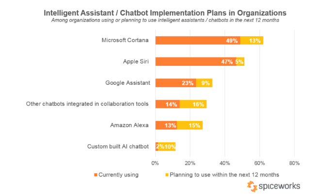
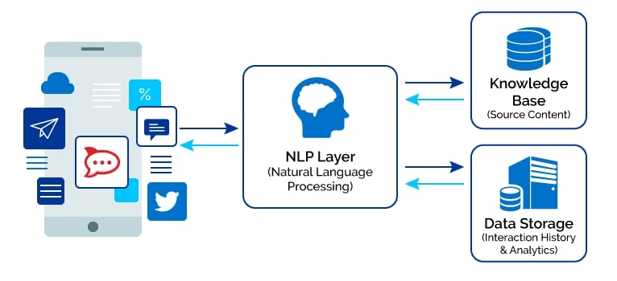

---
# This is the frontmatter which goes at the top of the MDX file
# Hashes in the frontmatter are comments
title: Web Technologies 
author: Srikanth Jallapuram
featuredImage: ./web.jpg
---

# AI Conversational Interfaces

import styles from '../../blog/ai-chatbot/another.module.css'

    Chatbots Will Be Indistinguishable From Humans by 2029

The first conceptualization of the chatbot is attributed to Alan Turing, who asked “Can machines think?” in 1950. Since Turing, chatbot technology has improved with advances in natural language processing and machine learning.

Interacting and interfacing with Traditional Internet as well as modern Digital Services has long been tied to keyboards, monitors and more lately mobile screens put together for more than forty years. The time is now for a change  as we need a new intelligent and universal means of interaction that can hold voice or text conversations to link humans and machines, and to connect customers and companies.  

According to a forecast by Gartner, by the end of 2020, we can see companies capturing almost 85 percent of consumer contact with the help of technology. This signifies the role of technology in customer interaction. Today, AI is not limited to only big companies. Thanks to a large number of technological innovations, any company irrespective of its size started adopting AI applications, and chatbots have been the front-runner.

 
    According to IBM - Per year 265 Billion Customer Requests are recorded. Businesses spent nearly $1.3 trillion to service these requests. Using Chatbots can help them save up to 30% of this.

### What is a Chatbot?

> *The most natural definition of a chatbot is – a developed a program that can have a discussion/conversation with a human. For example, any user could ask the bot an inquiry or a statement, and the bot will respond or perform an activity as appropriate.*

A chatbot is programmed to work independently from a human operator. It can answer questions formulated to it in natural language and respond like a real person. It provides responses based on a combination of predefined scripts and machine learning applications.

In this new wave of technology, conversation is the new interface, and chatbots are the new applications. The power of the natural language processing (NLP) and Deep Learning that process and parses human language, enable Chabots to create a simple and universal means of interacting with technology.

AI powered chatbots become more intelligent over time as they gather information and data thats then stored across their neural network. These deep learning processes is based on Natural Language Processing (NLP). NLP allows artificial intelligence (AI) bots to not only gather information, but also understand the intent of questions and human context. Think of NLP as the brain of AI bots. 

By the end of the year 2019, 40 percent of communications businesses will have their customers utilizing [chatbots](https://mindmajix.com/chatbot) and 80 percent of them over the next 5 years. These numbers are due to the increasing number of people utilizing messenger applications with 2019 being an important year for them.

Comprehending human conversation is no easy task for a computer, and companies all over the world have invested hundreds of millions of dollars into the effort. Many of them have successfully built a series of chatbot capabilities to help chatbot agents querying and searching product knowledge extracted from a comprehensive knowledge base or from advanced analytics from the enterprise backend. 

However, many challenges still remain for consumer users using the chatbots as below.

## So what are the Best Practices in building a Chatbot?

### Build a service that never sleeps

Chatbots offer a number of comparative advantages. They offer 24/7 availability, where a fully dedicated resource is providing you the desired service with unmatched control and transparency. They offer instant customer service and enhance brand value. Above all, since they are intelligent, bots can be scaled up quickly allowing you to focus on important tasks instead of being part of every conversation.

### Empower the convenient intelligence

Using the deep learning powers, you can train chatbots to behave more like a human and deliver interactions in different languages of your choice. You can improve  customer retention rate by providing a highly customized and personalized experience to each user. Their ability to deliver a cognitive digital experience and manage multiple interactions with natural interface makes them a very cost-effective option for customer support, e-commerce sales, information retrieval, help-desk and many more such cases.

Some other key benefits to be drawn from building and deploying bots in our organization are as below:

- **They cut down Operational Costs** 💰
  Per year there are a reported 265 Billion Customer Requests. Businesses spent nearly $1.3 trillion to service these requests. Using Chatbots can help you save up to 30% of this.
- **Chatbots empowers your Team** 💪
  Chatbots will not entirely replace humans. Rather they will become the first-level support that filters a customer request and save you time.
- **They boost your Brand Outlook** 🙌
  The visual interaction offers a friendly experience and ensures a healthy rapport with your customer base spread across the world.
- **It's easier than making an App** 💁‍♀️
  In the productivity category, chatbots outperform apps in all aspects of functionality and is more cost-effective.
- **Millennials love Chatbots** 👫
  The speed of communication and ease of use has given a sweet spot for chatbots in the Millennial audience compared to legacy tools.

### Conversational User Experience

Conversational User Experience (CUX) will be adopted by most businesses in 2019. It is a newer version of UX design, and have features like guided conversations, brand persona development, and personalized content. Its main purpose is to help businesses to create rapid and helpful customer interactions on their chatbot. CUX is something to keep in mind, as any business that fails to keep up with CUX may risk their customer support.

(NLP) Natural Language Processing Chatbots finds a way to convert the user's speech or text into structured data.  

The goal of natural language processing (NLP) is to take the unstructured output of the ASR and produce a structured representation of the text that contains spoken language understanding(SLU) or, in the case of text input, natural language understanding (NLU).

Which is then utilized to choose a relevant answer. Natural Language Processing includes the following steps;

1. **Tokenization:** The NLP separates a series of words into tokens or pieces that are linguistically representative, with a different value in the application.
2. **Sentiment Analysis:** It will study and learn the user's experience, and transfer the inquiry to a human when necessary
3. **Normalization:** This program model processes the text to find out the typographical errors and common spelling mistakes that might alter the intended meaning of the user request.
4. **Named Entity Recognition:** The program model of chatbot looks for different categories of words, similar to the name of the particular product, the user's address or name, whichever information is required.
5. **Dependency Parsing:** The Chatbot searches for the subjects, verbs, objects, common phrases and nouns in the user's text to discover related phrases that what users want to convey.

**Consumer Domain-Specific Bots**

AI powered chatbots can be built for specific consumer domains or industry verticals such as below.

**Transportation Bots**

Instalocate provides real-time flight tracking, security wait times,ability to file for compensation for delayed flights, ability to push notifications to WhatsApp, gate and terminal information, weather updates, airport directions, baggage information, and an ability to book cabs or Uber vehicles at the airport. The bot uses rule-based heuristics for responses;conversation is restricted to system-directed initiatives. 

**Dating:**

Foxsy suggests new friends to you based on user-specified settings. Effectively a Tinder-like applications embedded within the Messenger platform. The bot uses a very basic rule-based heuristic for responses; allows for user-directed conversation, but replies with “Sorry, I didn't get it” to most queries. 

**Mediation:**

Meditate Bot provides users with information about breathing exercises and body scans and allows users to schedule daily medications. The bot notifies users when it is time for their daily medications. Peaceful Habit offers similar functionality in scheduling and timing meditation routines for its users. 

**Fitness Bots:**

GymBot allows users to keep track of the number of exercises they've completed and track their improvement over time.  FitCircle generates five-minute workouts for users. Forksy asks you about what food you're eating, and scolds you for unhealthy choices. Whole Foods bot allows you to search for healthy recipes with text or emoji requests. 

**Weather Bots:**

Poncho is a weather bot with a distinctive personality that allows users to request the current weather conditions. The Weather Channel offers a more traditional weather bot, powered by IBM Watson. Other weather bots include: HippoBot, Weatherman,and Yahoo weather; they provide similar functionality with differing personality settings. 

**Medical Bots**

The symptoms defining medical conditions are often well-defined, and chatbots have the ability to improve rates of accurate self-diagnosis. One of the main problems with self-diagnosis is that most individuals do not know what questions to ask in order to diagnose a medical condition, and therefore are unable to use platforms like WebMD properly. Chatbots, which are able to ask follow-up questions until they are ready to make a diagnosis, solve that problem. Baidu,the Chinese search engine, for example, launched a diagnosis app called Melody in 2015, which responds to medical questions from users. 

## **Bot Evaluation**

**Evaluation Perspectives**

There are a number of different perspectives on how to evaluate chatbot performance. From an information retrieval (IR) perspective, chatbots have specific functions: there are virtual assistants, question-answer and domain-specific bots.

Evaluators should ask questions and make requests of the chatbot, evaluating effectiveness by measuring accuracy, precision, recall, and F-score relative to the correct chatbot response.

 From a user experience perspective, the goal of the bot is, arguably, to maximize user satisfaction. Evaluators should survey users (typically, measured through questionnaires on platforms such as Amazon Mechanical Turk), who will rank bots based on usability and satisfaction. 

From a linguistic perspective, bots should approximate speech, and be evaluated by linguistic experts on their ability to generate full, grammatical, and meaningful sentences. 

Finally, from an artificial intelligence (AI) perspective, the bot that appears most convincingly human (e.g. passes the Turing Test best) is the most effective. 

References:

1. Chatbot: Architecture, Design & Development by Jack Cahn
