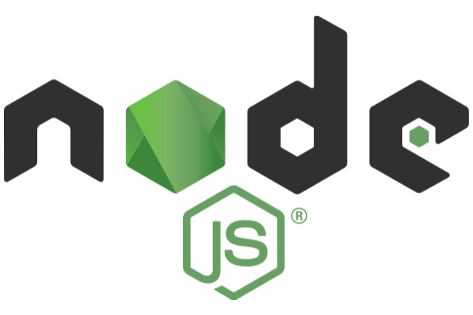
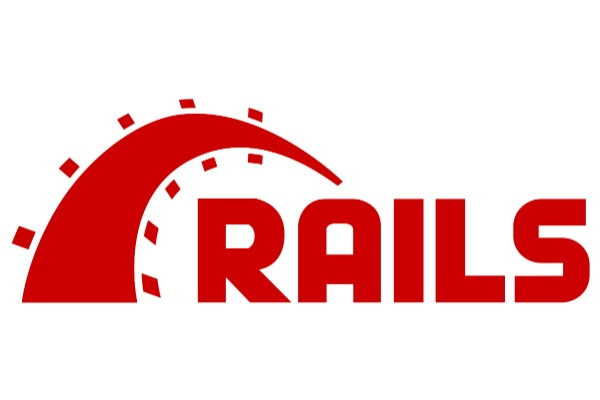
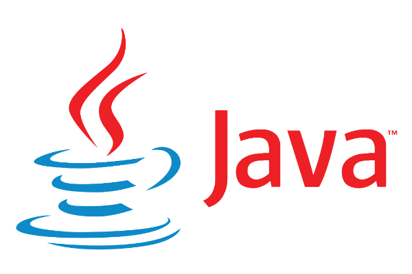
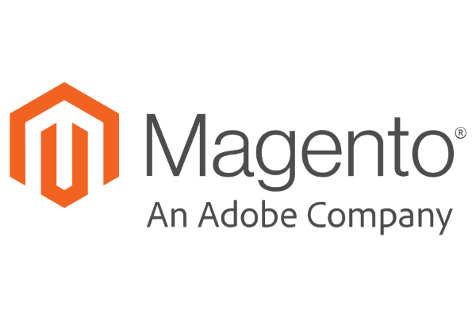
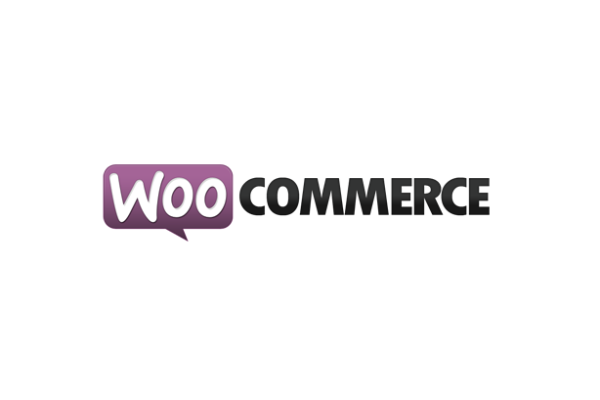
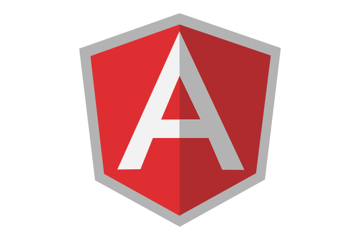
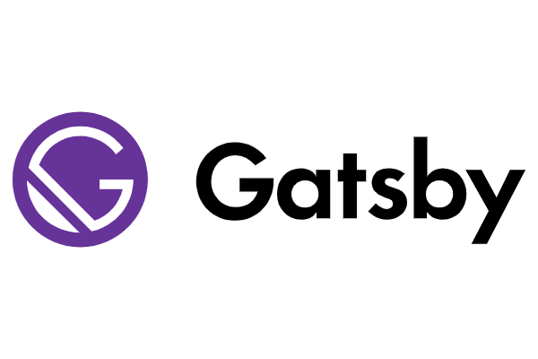
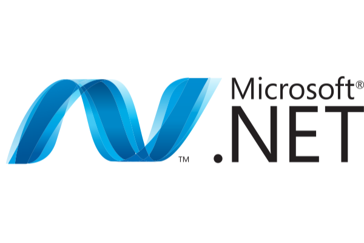
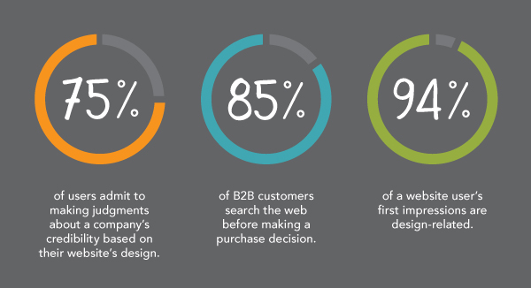

---
# This is the frontmatter which goes at the top of the MDX file
# Hashes in the frontmatter are comments
title: Web Development 
author: Srikanth Jallapuram
featuredImage: ./web2.png
---

import styles from '../../blog/ai-chatbot/another.module.css'
import './web.css';

Technovature revels in building world-class websites that are well designed, simple to use, robust and have a superior and responsive experience with users across the globe and across devices including smart phones that engage with the amazing content and layouts of the designed website. For this we use the latest and the best technology stacks that can create powerful, aesthetic, high performing and fast loading websites to the customer's delight.

> Two of of three people prefer to read beautifully designed content on a website. 

# Our Web Development Services

 

<h3 style="text-align:center"> Web Design </h3>

 
We design unique and highly responsive modern web experiencs that suit all audiences reaching it and to make your web site into a modern platform. It shall be a unique cornerstone of your digital identity that draws traffic from across the globe to engage with your brand. <strong> Design Elements </strong> like <strong> minimalism, color palletes, navigation, typography, white space, CTAs, responsiveness, iconography/photography </strong> are all important for a great design. 

 

<h3 style="text-align:center">  CMS Websites </h3>

Content Management Systems have evolved from the legacy wordpress to the modern JSON API driven <strong> Headless CMS (also now popularly known as the JAMStack architecture) like Ghost, Contentful, Strapi, Netlify CMS, Directus, Cockpit CMS</strong> and the headless version of Wordpress itself. We can help power your website with the most appropriate content management architecture that delivers results but most importantly should be quick to load and consumable on all devices small or big. 

 

<h3 style="text-align:center"> E-Commerce Websites </h3>

 
We design and build modern ecommerce websites that get results. We understand that modern e-commerce encompasses all of the touchpoints and processes throughout the <strong> entire consumer journey </strong>. This means that all of the tools, processes, and technologies used to create the online offer are critical to the overall definition. We pay attention to content development and product descriptions, research and development, marketing, promotions and social media, analytics, customer service and customer experience.

 

<h3 style="text-align:center"> SaaS Web App Development </h3>

Enterprises rely on SaaS Applications as it reduces the cost of setup and maintenance and they are accessible from everywhere via web. We understand that B2B SaaS applications require portability, a solid microservices and devops driven cloud architecture, onboarding automation and performance support, intelligent applications, deal with legacy systems with a solid ESB interface as needed with a centralized login while offering a customer success program after onboarding.

 

<h3 style="text-align:center"> API Development </h3>

Web APIs have experienced an exponential increase in popularity and usage in the past few years. They have become an effective marketing tool for many types of businesses. Web APIs allow us to build web pages and web based applications (known as "mashups") using data from multiple online sources. Although there are Web APIs available for many different types of industries, some of the most popular and widely used ones are in the categories of social networking, mapping, shopping and music.

 

<h3 style="text-align:center"> Microservices Development </h3>

Microservices have become a popular and effective design for scaling development teams in large companies. A microservices architecture enables you to build and deploy services independently, providing developers autonomy, enthusiasm, and a passion for their work. Whether you make SPA or MVC powered by Server Side Rendering as an architectural style or choice, however microservices is the place where the real work load is processed especially in the case of SaaS applications.

> 68% of the companies that developed a mobile-first website saw a rise in sales.

 

# Web Technologies We Use 

Modern website development has become very mature with a solid set of software and tools with full-stack capabilities combined with the power of a cloud hosting and cloud technologies and a swiss-army knife set of digital SEO technologies to track web analytics in real-time of your traffic and of your content engagement. With of all this we can fulfill the diverse needs of your enterprise to engage your consumers with your website or web application from any device or from any platform in a seamless fashion and with an exhilirating user experience. 

> 48% of people cited a website’s design as the number one factor in deciding the credibility of a business.

> 80% of organizations that use AI as part of their digital commerce strategies will see 25% or higher improvement in key performance indicators such as customer satisfaction, revenue, or cost reduction.

 

	

 

<h3 style="text-align:center"> ReactJS Applications </h3>

React is a JavaScript library that specializes in helping developers build user interfaces, or UIs. In terms of websites and web applications, UIs are the collection of on-screen menus, search bars, buttons, and anything else someone interacts with to USE a website or app. Powered by JSX and Virtual DOM, we can build stateless and stateful React Applications that can power your Web Frontend. The Component architecture of ReactJS makes it highly modular and reusable and very powerful from a performance perspective and from a speed of development perspective.

 

<h3 style="text-align:center"> NodeJS Web Applications </h3>

Node.js is actually not a framework or a library, but a runtime environment, based on Chrome’s V8 JavaScript engine. Using Node.JS in the backend provides for better efficiency and overall developer productivity, speed and performance, a huge number of free tools that provides for flexibility amongst team mwmbers while collaborating on the development. Non-blocking Input/Output and asynchronous request handling made Node.js capable of processing requests without any delays.

 

<h3 style="text-align:center"> Rails Apps </h3>

Ruby on Rails, also known as Rails, is a server-side web application framework written in Ruby programming language. It is a model-view-controller framework that provides a structure for a database and web pages. By experience it is observed that one can develop an application at least ten times faster with Rails than a typical Java framework. It can reduce your time of coding, it is already used in some biggest websites, it is based on agile development principles and it isquite easy to test.

 

<h3 style="text-align:center"> Java Web Applications</h3>

Java has been a defacto standard for developing Enterprise grade SOA based Web Applications from several years. It is platform independent, is highly secure, has a rich set of APIs, is already used in so many real world applications, has excellent developer IDE and toolkit for increased productivity. Java is an object-oriented programming language that supports multi-threading and is highly scalable. Latest versions of Java have made it even more productive to code in Java and the language itself has become quite powerful.

 

<h3 style="text-align:center"> Magento Commerce Applications </h3>

Magento is an ecommerce platform built on open source technology which provides online merchants with a flexible shopping cart system, as well as control over the look, content and functionality of their online store. Magento offers powerful marketing, search engine optimization, and catalog-management tools.
Magento can scale from a few products to easily expand to tens of thousands of products and complex custom behavior without changing platforms. It offers a variety of plug-ins and themes which can easily enhance a customer's experience.

 

<h3 style="text-align:center"> WooCommerce Web Applications</h3>

 
WooCommerce is a flexible, open-source commerce solution built on WordPress. WooCommerce empowers small and medium businesses to build exactly the store they want and sell online. In addition to the supporting market of extensions and plugins that’s grown up around WooCommerce, the WordPress development community has also embraced the plugin through the active development of several WooCommerce-compatible themes. WooCommerce itself offers Storefront, a free WordPress theme that’s designed to integrate deeply into the WooCommerce core plugin, maximize speed and site performance, and eliminate theme/plugin conflicts.

 

<h3 style="text-align:center"> AngularJS Apps </h3>

AngularJS is a JavaScript-based open-source front-end web framework used in developing single-page applications (SPA). It aims to simplify both the development and the testing of such applications by providing a framework for client-side model–view–controller (MVC) and model–view–viewmodel (MVVM) architectures, along with components commonly used in rich Internet applications. AngularJS is the frontend part of the MEAN stack, consisting of MongoDB database, Express.js web application server framework, Angular.js itself, and Node.js server runtime environment. 

 

<h3 style="text-align:center"> GatsbyJS Sites </h3>

Gatsby is a free and open source framework based on React that helps developers build blazing fast websites and apps. Gatsby.js is a PWA (Progressive Web App) generator. You get code and data splitting out-of-the-box. Gatsby loads only the critical HTML, CSS, data, and JavaScript so your site loads as fast as possible. With the help of GatsbyJS plugins, you can pull data from headless CMSs, SaaS services, APIs, databases, your file system, and more directly into your pages using GraphQL.

 

<h3 style="text-align:center"> NextJS Web Applications</h3>

 Next.js is a lightweight framework for static and server‑rendered applications.Next.js is a lightweight framework for static and server‑rendered applications. With Next.js, server rendering React applications has never been easier, no matter where your data is coming from. Next.js comes with styled-jsx included, but it also works with every CSS-in-JS solution you know and love. It comes with automatic code splitting, filesystem based routing, hot code reloading and universal rendering.

 

<h3 style="text-align:center"> PHP Web Applications </h3>

 
PHP is a server side scripting language. That means its processing happens in the server by consuming server’s resources and sends only the output to the client. PHP (or PHP Hypertext Preprocessor) is a server-side scripting language that is used to create dynamic web pages that can interact with databases. It is a widely-used open source language that is specifically used for web application development and can be embedded within HTML. The distinguishing feature of PHP is that the scripting code is executed on the server, which generates HTML that is sent back to the client. It can interact very well with Relational Databases such as MySQL, MariaDB, Oracle Databases etc.  

 

<h3 style="text-align:center"> Microsoft .NET Web Applications</h3>

 
ASP.NET Core is an open-source server-side web-application framework designed for web development to produce dynamic web pages developed by Microsoft to allow programmers to build dynamic web sites, applications and services. ASP .NET Web Pages also known as Razor provides a simple, clean, and lightweight way to create dynamic web content using HTML and C#. With Razor you can use any HTML or C# feature. You get great editor support for both, including IntelliSense, which provides auto-completion, real-time type and syntax checking, and more.

 

<h3 style="text-align:center"> HTML5 JS Applications </h3>

HTML5 is the future of web and web apps which makes it huge. It is exciting and can change the web. It is the next generation of web technology. It supports both mobiles and desktop dynamically. HTML5, together with CSS3 and JavaScript, is the foundation of cross platform web application development. It supports Cross platform application compatibility, Rich multimedia support, simplest implementation of dynamic objects and cross browser compatibility.

> In 2019, 57% of website traffic came from mobile.

### What is a Progressive Web Application?

Unreliable network connections are an unavoidable reality on the mobile web. But that doesn't mean they need to disrupt your users. Progressive web apps (PWA) leverage modern web technologies to provide offline support so your app never goes down.

Let janky scrolling and routing delays become a thing of the past. By intelligently caching app content, PWA's create a smooth user experience, no matter how sophisticated your application is. Eliminating navigation issues ensures you maximize user retainment.

### Web Development Statistics

<figure>

 
<figcaption class="center"> <strong>Fig 1.1 </strong> Important Fintech Statistics in 2020</figcaption>
</figure>
 
 

## So what are the Best Practices in FinTech Development ?

The emergence of new and disruptive financial technology is fueling the need for innovation by traditional financial institutions as they attempt to keep pace with demands for better technology-based services. Consumers are demanding more actionable and intuitive user experiences from bank technologies. As a result, the financial services industry is more focused on technology innovation than at any other point in its history.

Data aggregation—the ability to compile and create meaningful data from disparate sources—remains critical to providing innovative digital experiences to consumers. Indeed, modern financial data aggregation goes far beyond its initial beginnings of scraping financial data from screens and even from the structured data feeds that top aggregators use to gather consumer financial data for financial services organizations.

Data aggregation services today require a more comprehensive scope to cover leading practices in the following areas:
- Access to the Best Financial Data Available on a Massive Scale
- Financial Data that is Made to Do More – Data + Intelligence™
- Bank-Level Data Security

### Data Aggregation and Intelligence
#

In recent years, account data aggregation has evolved in response to major industry trends that include: the move to cloud technologies, the emergence of Big Data, user experiences that demand rich real-time data, and the flexibility of open platform models. With the growth in consumer demand for financial guidance from their financial institutions, advisors, and consumer apps, data aggregation has taken on greater importance as a strategic asset.

### Data Aggregation Considerations 

Financial data aggregation is the automatic collection of
personal financial account data from multiple sources,
within and outside the financial institutions, into a single
resource. Data is compiled from different accounts that
often include bank, credit card, and investment accounts,
as well as other consumer or business accounts.

### Data Intelligence Opportunities

Big Data, however, generally refers to a set of technologies that manage massive data sets—like the data that comes from financial aggregation. The most interesting trends in the area now involve how organizations can use the wealth of data that is available to drive decisions, support product development, and identify customer needs.

These goals go beyond data reporting and enter the realm of data intelligence, a data science discipline in its own right. “Data intelligence has a slightly different philosophy (than big data) that embraces some of the messy and unstructured nature of the world that we do live in,” says Sean Gourley, Co-Founder and CTO, Quid, a data intelligence firm.2

Data intelligence helps improve processes and results, according to a survey by the Association of Financial Professionals.3 According to more than half of all respondents and some 80 percent of respondents
at organizations with successful data intelligence programs in place, data intelligence provides the following benefits:
- Accuracy of analysis
- Ability to identify relevant and available data sources
- Ability to reach actionable conclusions from analysis

Data intelligence leverages data science to give big data its power. The real worth of data aggregation lies in the ability to tap the insights that lie in the underlying data. Assuming high-quality data, data intelligence provides an analytics layer on top of the aggregation platform that enables pattern and insight recognition and can help:
- Anticipate consumer financial needs
- Provide customers with ability to create a uniquely personalized user experience
- Predict future activity along with simple, actionable guidance

### Security Risk Assessments 

Protecting personal information of individuals who use our customers’ products and services must be a top priority for any data aggregation service. The heightened awareness of security breaches in the financial system only heightens the need for a complete and thorough review of the security standards followed by any third party that handles financial data.

### The Innovative Imperative

Innovation is not generally considered a strength of financial institutions. For traditional financial institutions to build on their competitive advantage and regain the profits they have enjoyed in the past, however, innovation must become a best practice in financial services.
It’s no surprise that large, traditional banking and other financial services firms have largely avoided serious innovation for decades. From disparate data silos to archaic back-end software platforms, the financial services industry is working with systems that, in some cases, have been functioning for decades. Any major change is risky to existing customer operations.

Today, there are hundreds of new FinTech entrants, born in the digital age, that have accelerated the delivery of smarter and more personalized financial solutions that are often faster, and easier to use. Building anew is much easier than renovating outdated service platforms. As a result, disruptive FinTech innovation tends to occur in newer and more nimble financial service firms.

Reference: " Best Practices for Driving the FinTech
Digital Transformation " by ENVESTNET Yodlee
