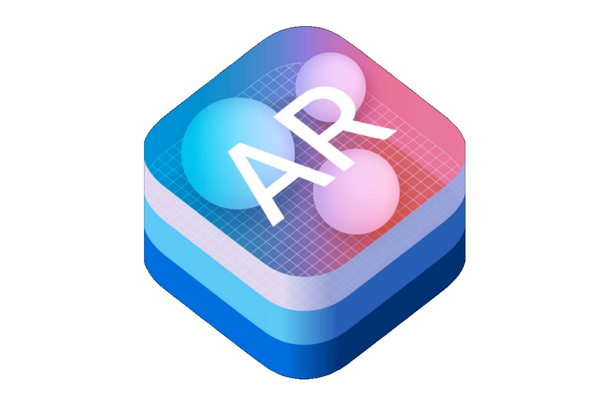
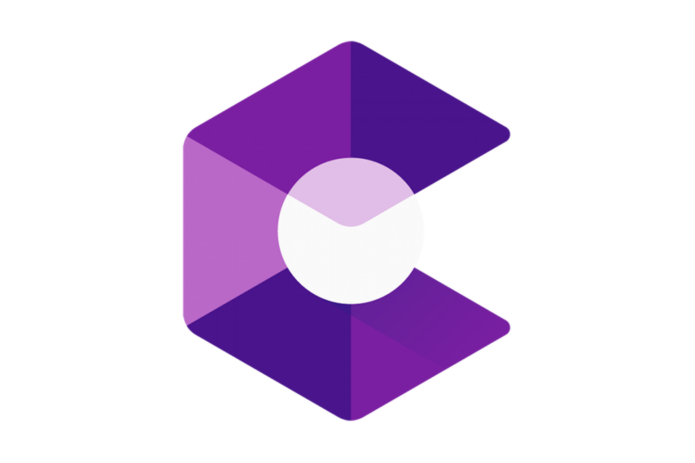
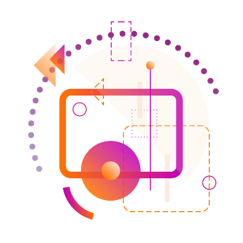
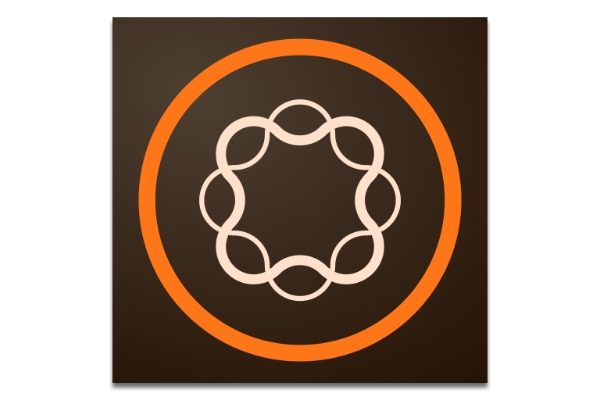

---
# This is the frontmatter which goes at the top of the MDX file
# Hashes in the frontmatter are comments
title: Extended Reality 
author: Srikanth Jallapuram
featuredImage: ./images/ar-woman-02.jpg
---

import styles from '../../blog/ai-chatbot/another.module.css'
import './xr.css';

> The concept of human mobility is being engineered in alignment with the human experience.

Our Innovation in Connected Car and Autonomous technologies is driven by a solid confluence of maturing of technologies in the areas of sensors, in-car and on-board digital diagnostics, internet of things, machine-to-machine, artificial intelligence, highly precisee mapping and navigation and finally by the cloud computing technologies. All these technologies have influenced heavily in building the car of the future, which is electric, completely digital in nature and autonomous in many cases.

> 5G NR – standalone or SA – mode rollout, which promises lower latencies, will be critical for creating an inflection point in the commercialisation of autonomous cars later in the next decade

# Our AR Kit Development Capabilities 
 

 

<h3 style="text-align:center"> Apple ARKit Development</h3>

 
Build unparalleled augmented reality experiences for hundreds of millions of users on iOS using the ARKit from Apple. ARKit combines device motion tracking, camera scene capture, advanced scene processing, and display conveniences to simplify the task of building an AR experience. You can use these technologies to create many kinds of AR experiences, using either the back camera or front camera of an iOS device.

 

<h3 style="text-align:center"> Android ARCore Development</h3>

ARCore is Google’s platform for building augmented reality experiences. Using different APIs, ARCore enables your phone to sense its environment, understand the world and interact with information. Some of the APIs are available across Android and iOS to enable shared AR experiences. ARCore uses motion tracking, environmental understanding to detect the size and location of all types of surfaces and light estimation that allows the phone to estimate the environment's current lighting conditions.

 

<h3 style="text-align:center"> Unity 3D AR Development</h3>

A framework purpose-built for AR development allows you to develop your app once, then deploy it across multiple mobile and wearable AR devices. It includes core features from each platform, as well as unique Unity features that include photorealistic rendering, physics, device optimizations, and more.

 

<h3 style="text-align:center"> Vuforia AR Development</h3>

Vuforia Engine is the most widely used platform for AR development, with support for leading phones, tablets, and eyewear. Developers can easily add advanced computer vision functionality to Android, iOS, and UWP apps, to create AR experiences that realistically interact with objects and the environment. We can develop AR Solutions for Manufacturing, AR Solutions for Service and AR Solutions for Sales &amp; Marketing. Vuforia Engine is the world's leading Augmented Reality Engine used for wide variety of Applications in the industrial/manufacturing space. 

### Augmented Reality Backend Content Management Systems

While the AR/XR devices are capable of doing the visual magic of Augmented Reality. Behind all that magic is the real-time delivery of contextual information delivered via cloud from a headless Content Management System (CMS) that powers all your Augmented/Extended Reality Experiences on your favorite AR/XR devices.

Headless CMS or a Content Cloud lets your AR/XR Devices preview content via API requests, giving their Headless PLUS CMS power and agility. Its JSON format makes integration with front-end platforms an uncomplicated process.

Separation of content management and front-end layers allows your business to develop a user experience that meets the rigours of today’s complex and multi-channel environment. A headless CMS can provide huge benefits in scalability, agility, freedom and flexibility.

 

<h3 style="text-align:center"> Kentico Kontent CMS</h3>

 
Kentico cloud headless CMS launched is a software as a service (SaaS) platform that allows managing all content of in one place and display it on any channel using a representational state transfer (REST) API. It contains advanced features such as content validation, asset management, rich text with modular content, webhook for published content, scheduled publishing, etc.

 

<h3 style="text-align:center"> Adobe Experience Manager</h3>

 
Adobe Experience Manager (AEM), is a comprehensive content management solution for building websites, mobile apps and forms. And it makes it easy to manage your marketing content and assets. Build lifetime value - deliver digital experiences over the lifetime of your customer that build brand loyalty and drive demand. Adobe Experience Manager Assets (Digital Asset Management) gives you automation and smart tools to rapidly source, adapt, and deliver your assets across audiences and channels.

 

<h3 style="text-align:center"> Contentful Headless CMS </h3>

 
Contentful is a Headless CMS platform offering application programming interfaces (APIs) for managing, integrating, and delivering content to any device or service. It provides a robust content model creator and content editor that allows for provisioning rich multimedia and content for a variety of use cases including for Augmented Reality and Virtual Reality devices.

